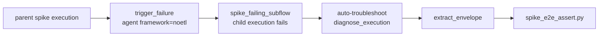

# Agent Failure Diagnostics Contract

NoETL treats a playbook execution as the audit boundary for AI work.
When one playbook calls another through `tool: kind: agent` with
`framework: noetl`, failures must remain inspectable as agent data,
not collapse into generic worker errors. This page collects the
diagnostic contract that was hardened across the v2.35.x Gap 1 and
Gap 4.1 fixes.

## Contract Summary

| Concern | Contract |
|---|---|
| Agent envelope | `status: "error"` inside an agent envelope is valid agent output. It is not automatically a worker `tool_error`. |
| Sub-execution wait | A `framework: noetl` agent call waits for the child execution to reach a terminal state before the parent step consumes the envelope. |
| Auto-troubleshoot | When enabled, the troubleshoot agent runs after the child execution fails and the parent fetches the persisted diagnosis before attaching it. |
| Projection | Terminal events must preserve nested control objects such as `result.context.error.diagnosis`. |
| Regression guard | The spike e2e workflow plus the five-smoke battery must stay green before changing this surface. |

## Gap 1: Agent Envelope Wait

The Gap 1 failure mode was a race between the parent playbook and a
child playbook called as an agent. The child returned a structured
agent envelope, but downstream extraction could observe an intermediate
dispatch handle before the child reached a terminal state.

The fixed behavior:

1. `tool: kind: agent` with `framework: noetl` dispatches the child
   playbook.
2. The parent waits for the child execution to reach `completed`,
   `failed`, `cancelled`, or another terminal state.
3. The parent step receives the final agent envelope.
4. Downstream steps such as `extract_envelope` read the envelope from
   stable data rather than from an in-flight dispatch handle.

The important distinction is that the agent envelope can itself carry
`status: "error"`:

```json
{
  "status": "error",
  "framework": "noetl",
  "entrypoint": "tests/spike/spike_failing_subflow",
  "execution_id": "617...",
  "error": {
    "kind": "agent.execution",
    "code": "PLAYBOOK_FAILED",
    "message": "child execution failed",
    "diagnosis": {
      "category": "transient_5xx",
      "confidence": 0.82,
      "root_cause": "upstream returned HTTP 500",
      "suggested_action": "retry after checking upstream status",
      "source": "ollama"
    }
  }
}
```

That is a successful worker result containing an agent-level failure.
The worker should not coerce it into a generic `tool_error` just because
the envelope's own `status` is `error`.

## `kind: agent` Carve-out

Most tool kinds use a simple rule: if the tool response says
`status: "error"`, the worker emits a failed tool result. Agents need a
carve-out because the envelope is the contract.

For `tool_kind == "agent"`:

- the worker preserves the envelope as the step result;
- downstream steps can inspect `result.status`, `result.error`, and
  `result.execution_id`;
- the parent execution can continue to an error-handling step such as
  `extract_envelope`;
- only transport, configuration, or executor failures outside the
  envelope should become generic worker errors.

This is what allows playbooks to treat agents as composable programs:
the caller decides what to do with the agent's failure data.

## Gap 4.1: Diagnosis Wait and Fetch

The Gap 4.1 failure mode was similar, but one layer deeper. The
auto-troubleshoot hook attached the diagnosis dispatch handle instead
of the actual diagnosis dictionary. The parent saw that a diagnosis had
started, but did not consistently wait for the diagnosis execution and
fetch the final persisted object.

The fixed behavior:

1. A `framework: noetl` agent child fails.
2. The auto-troubleshoot hook dispatches
   `automation/agents/troubleshoot/diagnose_execution`.
3. The hook waits for that diagnosis execution to reach a terminal
   state.
4. The hook fetches the diagnosis from persisted events.
5. The parent attaches the actual diagnosis dictionary under
   `error.diagnosis`.

The diagnosis object must include these keys:

| Key | Meaning |
|---|---|
| `category` | Failure class such as `transient_5xx`, `auth`, `rate_limit`, `infra`, or `unknown`. |
| `confidence` | Model confidence after parsing and clamping. |
| `root_cause` | Short explanation of the likely cause. |
| `suggested_action` | Operator action or retry guidance. |
| `source` | The source that produced the diagnosis, such as `ollama`, `openai`, `claude`, or `remote`. |

If the diagnosis path itself fails, NoETL returns the original agent
envelope unchanged. Diagnostics augment failures; they do not hide or
replace the original failure.

## Event Projection Contract

NoETL has several views of an execution: live worker responses,
persisted `noetl.event` rows, and read-side API projections. The
diagnostic contract depends on all of them preserving the same nested
control data.

The critical path is:

```text
result.context.error.diagnosis
```

That nested dictionary must survive:

1. worker terminal event construction;
2. server ingestion into the event log;
3. read-side projection and `/api/executions/{execution_id}`;
4. GUI/report rendering.

The projection chokepoint is the control-context extraction path in the
NoETL server. When adding a new nested control object, add both:

- a fixture that proves the object survives live-vs-persisted parity;
- an explicit projection carve-out for the nested path.

Do not rely on scalar-only key retention for control metadata. That is
the class of regression that caused nested `error.diagnosis` loss.

## Spike E2E Workflow

The spike e2e playbook is the worked example for this contract. Its
shape is intentionally small:



The successful assertion proves all of these at once:

- the child execution failed in the expected way;
- the agent envelope reached the parent after the child was terminal;
- `status: "error"` remained an agent envelope, not a worker
  `tool_error`;
- auto-troubleshoot attached a real diagnosis dictionary;
- the persisted execution API preserved the nested diagnosis;
- the report can be consumed by the GUI, CLI, and bridge tasks.

Run it from `ai-meta`:

```bash
EXEC_ID=$(noetl exec tests/spike/spike_e2e_test \
  --runtime distributed \
  --payload '{"escalate_to":"none"}' \
  --json | jq -r '.execution_id')

curl -s "http://localhost:8082/api/executions/${EXEC_ID}?page_size=500" \
  > /tmp/noetl-spike-${EXEC_ID}.json

python3 scripts/spike_e2e_assert.py /tmp/noetl-spike-${EXEC_ID}.json
python3 scripts/live_vs_persisted_parity_smoke.py --execution-id "${EXEC_ID}"
```

## Five-Smoke Regression Battery

Before changing the agent, troubleshoot, MCP, or projection surfaces,
run the five local smokes from the `ai-meta` checkout:

| Smoke | What it protects |
|---|---|
| `scripts/agent_envelope_carveout_smoke.py` | The Gap 1 `kind: agent` envelope carve-out and wait behavior. |
| `scripts/gap41_diagnosis_wait_smoke.py` | Diagnosis wait/fetch behavior and required diagnosis keys. |
| `scripts/auto_troubleshoot_smoke.py` | Auto-troubleshoot contract, parsing, and escalation hooks. |
| `scripts/optional_ai_smoke.py` | Optional dependency behavior when AI subsystems are absent. |
| `scripts/live_vs_persisted_parity_smoke.py` | Static and live checks for nested dictionary preservation. |

Expected counts for the v2.35.x surface:

```text
agent_envelope_carveout_smoke.py  -> 8/8
gap41_diagnosis_wait_smoke.py     -> 7/7
auto_troubleshoot_smoke.py        -> 9/9
optional_ai_smoke.py              -> 6/6
live_vs_persisted_parity_smoke.py -> static pass, cluster pass when given a spike execution id
```

If any of these fail, treat the change as a regression until the
failure is understood.

## See Also

- [Agent Orchestration](./agent_orchestration.md)
- [Self-Troubleshoot Agent](./self_troubleshoot_agent.md)
- [Triage Model Selection](./triage_model_selection.md)
- [Ollama Bridge](../operations/ollama_bridge.md)
