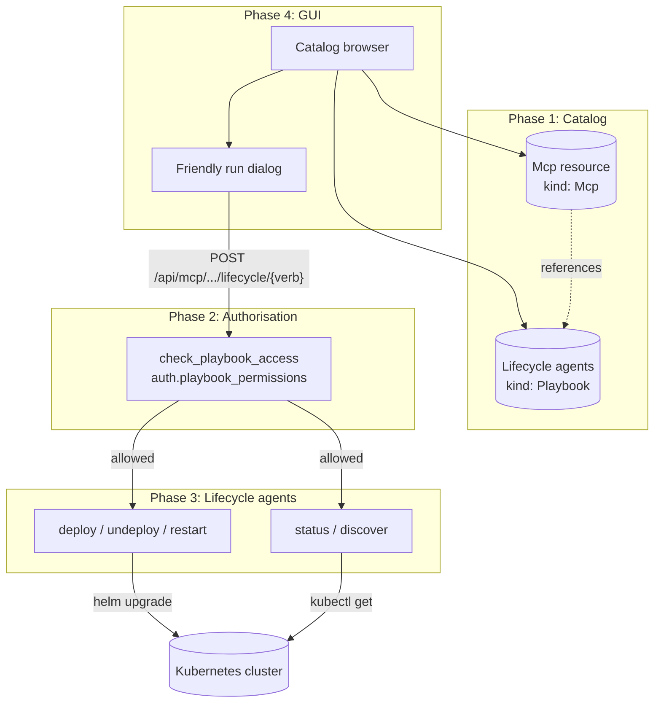

# NoETL Catalog-Driven MCP Architecture

How NoETL turns the [Model Context Protocol](https://modelcontextprotocol.io/)
into a first-class object in the catalog: registered alongside
playbooks and credentials, deployed and operated entirely through
playbooks, surfaced in the GUI as a friendly form-driven workspace.

This document is a high-level tour. For the deploy walkthrough,
see [MCP End-to-End on Local Kind](../operations/mcp_end_to_end_local_kind);
for the GKE variant, see
[MCP End-to-End on GKE](../operations/mcp_end_to_end_gke).

## Why this design

A working MCP integration needs three things working together:

1. **Where does an MCP server live?** Some are managed services
   (Anthropic-hosted), some run in-cluster (a kubernetes-mcp-server
   Deployment), some are local processes. The system has to know
   how to reach each one *and* how to provision new ones.
2. **Who can run what?** Granting "may invoke `pods` on the
   Kubernetes MCP" should not require a separate IAM system —
   the same authorisation primitives that gate playbook execution
   should gate MCP tool calls.
3. **What's it doing right now?** Every MCP call should be
   visible in the same execution dashboard that shows playbook
   runs. Same events, same audit trail, same retry semantics.

The answer NoETL converged on: **the catalog is the source of
truth, and every MCP operation goes through a playbook**.

## The four phases



Each phase is implemented and merged:

| Phase | Implementation | Released in |
|---|---|---|
| 1 — `Mcp` resource lifecycle endpoint | `/api/mcp/{path}/lifecycle/{verb}` + `_ui_schema` | noetl ≥ 2.26 |
| 2 — server-side `check_playbook_access` | `noetl/server/api/auth/check_access.py` | noetl ≥ 2.27 |
| 3 — Kubernetes MCP lifecycle agent fleet | `automation/agents/kubernetes/lifecycle/*` | ops main |
| 4 — friendly run dialog + Mcp tile renderer | `gui/src/components/PlaybookRunDialog.tsx` | gui ≥ 1.3 |

## Phase 1 — `kind: Mcp` is a catalog resource

`Playbook`, `Credential`, `Memory` and now `Mcp` all live in the
same catalog table, distinguished by their `kind` column. An
`Mcp` resource looks like:

```yaml
apiVersion: noetl.io/v2
kind: Mcp
metadata:
  name: kubernetes
  path: mcp/kubernetes
spec:
  url: http://kubernetes-mcp-server.mcp.svc.cluster.local:8080/mcp
  protocol: mcp/1.0

  lifecycle:
    deploy:    automation/agents/kubernetes/lifecycle/deploy
    undeploy:  automation/agents/kubernetes/lifecycle/undeploy
    redeploy:  automation/agents/kubernetes/lifecycle/redeploy
    restart:   automation/agents/kubernetes/lifecycle/restart
    status:    automation/agents/kubernetes/lifecycle/status
    discover:  automation/agents/kubernetes/lifecycle/discover

  discovery:
    initialize_url: http://kubernetes-mcp-server.mcp.svc.cluster.local:8080/healthz
    tools_list_url: http://kubernetes-mcp-server.mcp.svc.cluster.local:8080/mcp/tools
    refresh_via:    automation/agents/kubernetes/lifecycle/discover

  runtime:
    agent: automation/agents/kubernetes/runtime

  deployment:
    namespace: mcp
    chart_ref: oci://ghcr.io/containers/charts/kubernetes-mcp-server
    image_tag: v0.0.61
    toolsets: "core,config"
```

Every block describes intent rather than commands:

- `spec.url` — where the running MCP server lives
- `spec.lifecycle.{verb}` — which playbook deploys/inspects/operates this MCP
- `spec.runtime.agent` — which playbook the GUI calls when a user invokes a tool
- `spec.deployment` — knobs the lifecycle agents read at install time

The server exposes:

- `POST /api/mcp/{path}/lifecycle/{verb}` — dispatch a lifecycle agent
- `POST /api/mcp/{path}/discover` — refresh the tools list
- `GET /api/catalog/{path}/ui_schema` — render a workload form for any catalog entry

## Phase 2 — auth-as-playbook, server-side

Every dispatch through the MCP routes runs `check_playbook_access`
*on the server*, against the same `auth.playbook_permissions`
table the gateway already used:

- `enforce` — deny → 403, missing token → 401, DB error → 503
- `advisory` — log "would deny", proceed
- `skip` — pass through (the local-kind default)

The GUI can also call `/api/auth/check-access` itself for UI
gating (greying out a button before the user clicks it). The
server-side enforcement is the source of truth even if the GUI
were lying.

## Phase 3 — lifecycle agents are playbooks

Each lifecycle verb is a regular `kind: Playbook` resource with
`metadata.agent: true`:

```yaml
# automation/agents/kubernetes/lifecycle/deploy.yaml
metadata:
  name: kubernetes_mcp_lifecycle_deploy
  path: automation/agents/kubernetes/lifecycle/deploy
  agent: true
  capabilities: [kubernetes, mcp:lifecycle:deploy]

workload:
  mcp_resource: ...   # populated by the dispatcher
  verb: deploy
  expected_kube_context: kind-noetl

workflow:
  - step: deploy
    tool:
      kind: shell
      cmds:
        - |
          # in-cluster guard: skip the local-terminal check
          if [ -z "${KUBERNETES_SERVICE_HOST:-}" ]; then
            ...
          fi
          helm upgrade --install "$RELEASE_NAME" "$CHART_REF" ...
    next:
      spec: { mode: exclusive }
      arcs: [{ step: end }]

  - step: end
    tool:
      kind: python
      code: |
        result = {"status": "completed", "agent": "...", "text": deploy_output}
```

A few things worth noticing:

- **Same DSL.** Lifecycle agents use the exact same `workflow:` /
  `step:` / `tool:` shape every other playbook does. Nothing
  special about being a "lifecycle agent" beyond the
  `metadata.agent: true` flag and the `capabilities:` list.
- **`kind: shell` runs everywhere.** The distributed worker now
  ships its own shell tool kind that calls `subprocess.run` with
  Jinja-rendered commands, conservative env forwarding (only
  PATH + KUBERNETES_SERVICE_HOST + explicit `task.env`), per-cmd
  timeout, and structured failure aggregation. The local rust
  binary's `kind: shell` works the same way.
- **In-cluster vs local.** The `KUBERNETES_SERVICE_HOST` env var
  (which the kubelet always sets inside a Pod) lets the same
  agent run from an operator's terminal *or* from a worker pod.
  The local terminal path keeps the kubectl-context guard;
  in-cluster execution skips it because the worker's SA already
  pins it to the right cluster.
- **Results flow back as events.** The python `end` step
  explicitly returns a structured result with `status`, `text`,
  `mcp_path`, `verb`. The dispatcher's `playbook.completed`
  event surfaces that text inline in the GUI's run dialog.

## Phase 4 — friendly run dialog + Mcp browser

The GUI's catalog browser auto-detects `kind: Mcp` entries and
renders them as workspaces with verb-buttons:

```
mcp/kubernetes :: Read-only Kubernetes runtime agent backed by the Kubernetes MCP server

[ status ]  inspect through agent playbook
[ tools ]   list MCP tools through agent playbook
[ deploy ]  full helm upgrade via lifecycle.deploy
[ pods ]    runtime agent: pods across namespaces
[ events ]  runtime agent: recent cluster events
...
```

Each button opens a **friendly run dialog** generated from
`/api/catalog/{path}/ui_schema`. The endpoint walks the
playbook's `workload:` block and emits a JSON-Schema-shaped
description of every field — Antd renders `string` as inputs,
`enum` as selects, `object` as JSON textareas with live
validation, `boolean` as checkboxes. The user submits, the
dispatcher validates the workload against the agent's Pydantic
contract, and the resulting execution streams back into the
dialog through SSE.

Two things make this nice in practice:

- **No code path drift.** The form fields are derived from the
  agent's actual `workload:` schema. If you add a field, the
  form picks it up next time the user opens the dialog. No
  `<form>` to maintain alongside the YAML.
- **Polling is epoch-guarded.** Closing the dialog mid-run can't
  zombie the polling loop — `stopPolling()` increments an epoch
  counter and any in-flight `getExecution()` bails before
  re-scheduling.

## Cross-cutting: the DSL schema

The same Pydantic models (`Playbook`, `Step`, `NextRouter`,
`Tool`, ...) drive:

- **Server validation** at `POST /api/catalog/register` — a
  malformed playbook gets a 422 with the field path before it
  hits the catalog
- **Engine load** at execute time — every playbook the
  worker picks up is reconstructed from the same model
- **A published JSON Schema** at `noetl/core/dsl/playbook.schema.json`,
  auto-generated from the Pydantic models via
  `python -m noetl.core.dsl._generate_schema`. Editors that
  read the schema URL get autocomplete and inline error
  reporting against the canonical v10 contract.

Catalog `kind` is also authoritative from the YAML payload, not
the request parameter — `noetl catalog register
mcp_kubernetes.yaml` correctly stores it as `kind: mcp` even
when the CLI defaults its hint to `Playbook`.

## Cross-cutting: RBAC

Two service accounts, two ClusterRoles:

| SA | Lives in | Granted by | What it does |
|---|---|---|---|
| `noetl-worker` | `noetl` namespace | `noetl-worker-lifecycle-installer` ClusterRole | helm install + kubectl create namespace + apply chart resources |
| `kubernetes-mcp-server` | `mcp` namespace (chart-managed) | `kubernetes-mcp-server-reader` ClusterRole | read pods/events/services/etc. across all namespaces |

Both are namespace-scoped Subjects bound to cluster-wide rules,
narrowed to read for the MCP server and CRUD-on-chart-resources
for the worker. Neither is `cluster-admin` — the broadest verbs
each really needs.

## Why dispatcher → worker → in-cluster execution

A reasonable alternative is to have the noetl-server execute
shell commands directly. We chose the dispatch path because:

- **Audit trail.** Every lifecycle invocation produces the same
  `playbook.initialized` / `command.issued` / `command.done`
  events as a regular playbook run. No special tracing for MCP
  ops.
- **Backpressure.** The worker pool has admission/concurrency
  controls. A burst of `lifecycle.status` calls from a polling
  GUI doesn't compete with helm-driven `lifecycle.deploy` runs
  for a single thread on the noetl-server pod.
- **Failure isolation.** A misbehaving shell that pegs CPU or
  burns through file descriptors hurts a worker pod, not the
  serving pod that the GUI depends on.
- **Consistency.** Same dispatch semantics, same retry config,
  same error envelope as every other tool kind. Lifecycle
  operations look like any other playbook execution from the
  outside.

## Where the architecture is going

Open follow-ups (none blocking):

- **Mcp tab + Add-MCP wizard** in the GUI. With the JSON schema
  + the curated `mcp_kubernetes.yaml` template, the wizard can
  prefill from a known-good shape and live-validate user input
  against `playbook.schema.json` as they type.
- **Bake the kubernetes-mcp-server reader RBAC into the chart
  values** so a fresh `lifecycle.deploy` doesn't need a manual
  `kubectl apply` after.
- **Tighter cluster RBAC for the worker** by label selector or
  namespace allowlist once helm 3.x supports the necessary
  scoping cleanly.
- **More MCP servers.** The catalog template shape is generic —
  any MCP server that ships a helm chart can drop into the same
  lifecycle agent fleet with a different `spec.deployment.chart_ref`
  and new `spec.runtime.agent`.

## Read more

- [MCP End-to-End on Local Kind](../operations/mcp_end_to_end_local_kind) — full bring-up from scratch
- [MCP End-to-End on GKE](../operations/mcp_end_to_end_gke) — same architecture in the cloud
- [Older Kubernetes MCP runbook](../operations/kubernetes-mcp-local-kind) — pre-architecture-PR, kept for context
- [Sink-driven storage](sink_driven_storage) — the event/projection pattern this builds on
