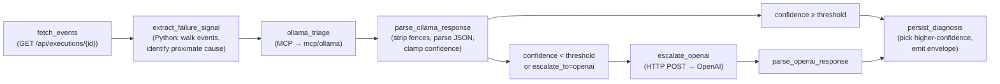

# Self-Troubleshoot Agent

A NoETL playbook that diagnoses *other* failed NoETL executions:
fetches the event log, classifies the failure with a local Ollama
model (cheap-first), escalates to OpenAI only when the local model's
confidence is low, returns a structured diagnosis the GUI and
programmatic callers can both consume.

The agent is the worked example for the NoETL-as-AI-OS architecture:
it composes [`tool: agent framework=noetl`](./agent_orchestration.md),
[playbook-as-MCP-server](./playbook_as_mcp_server.md), the
[typed metadata](./mcp_catalog_architecture.md#metadata-fields), and
the [Ollama bridge](../operations/ollama_bridge.md) into a single
self-contained agent.

## Why cheap-first

Calling OpenAI / Claude for every failure in a fleet is slow and
wasteful when most failures look identical to ones a 2B-parameter
local model can classify in 200ms.

| Approach                             | Latency  | Cost per failure |
|--------------------------------------|----------|------------------|
| OpenAI / Claude for every failure    | ~3s      | ~$0.01           |
| Ollama-only                          | ~200ms   | $0.00            |
| **Cheap-first with escalation**      | ~200ms*  | ~$0.001*         |

\* Most failures (HTTP 5xx, transient timeouts, known patterns) stay
on the Ollama path. Escalation runs only on novel / interesting
failures — typically `<10%` in steady state.

At fleet error volumes (O(thousands) per day) this is the difference
between $0/day and ~$30/day in inference spend.

## Flow



## Agent envelope

```json
{
  "status": "ok",
  "diagnosis": {
    "execution_id": "619156384600293663",
    "category": "transient_5xx",
    "confidence": 0.82,
    "root_cause": "Amadeus sandbox returned HTTP 500 on a well-formed query",
    "suggested_action": "Retry; if persistent, check api.amadeus.com status page",
    "source": "ollama",
    "escalated": false
  },
  "summary": "Amadeus sandbox is temporarily unavailable; retry shortly.",
  "text": "Amadeus sandbox is temporarily unavailable; retry shortly.",
  "user_message": "Amadeus sandbox is temporarily unavailable; retry shortly."
}
```

The `summary` / `text` / `user_message` fields all carry the same
friendly one-liner, mirroring the GUI's `extractAgentText` heuristic
so prompt and execution views can show a concise result inline.
`data.diagnosis` carries the structured form for programmatic callers
(other playbooks, auto-dispatch hooks, CI integrations).

## Workload knobs

| Key                    | Default                                            | What it controls                       |
|------------------------|----------------------------------------------------|----------------------------------------|
| `execution_id`         | `""` (required)                                    | which failed execution to diagnose     |
| `noetl_url`            | `http://noetl-server.noetl.svc.cluster.local:8080` | NoETL API base                         |
| `triage_model`         | `gemma3:4b`                                        | model for first-pass triage            |
| `triage_mcp_server`    | `mcp/ollama`                                       | catalog path of the triage MCP backend |
| `confidence_threshold` | `0.7`                                              | escalate when local confidence < this  |
| `escalate_to`          | `openai`                                           | `openai` / `claude` / `none`           |
| `openai_credential`    | `openai_token`                                     | keychain entry for OpenAI API key      |
| `openai_model`         | `gpt-4o-mini`                                      | OpenAI model for escalation            |
| `anthropic_credential` | `anthropic_token`                                  | keychain entry for Anthropic API key   |
| `anthropic_model`      | `claude-haiku-4-5`                                 | Anthropic model for escalation         |

## How callers reach it

Three surfaces:

1. **From a peer playbook**, via `tool: agent framework=noetl`:

   ```yaml
   - step: diagnose_recent_failure
     tool:
       kind: agent
       framework: noetl
       entrypoint: automation/agents/troubleshoot/diagnose_execution
       payload:
         execution_id: "{{ failed_id }}"
         triage_mcp_server: mcp/ollama
         triage_model: gemma3:4b
         confidence_threshold: 0.85
   ```

2. **Automatically on failure**, via the agent executor's
   auto-dispatch hook
   (see [Agent Orchestration → Auto-troubleshoot on failure](./agent_orchestration.md#auto-troubleshoot-on-failure)):

   ```yaml
   - step: ask_amadeus
     tool:
       kind: agent
       framework: noetl
       entrypoint: api_integration/amadeus_ai_api
       on_failure:
         troubleshoot: true        # diagnosis attaches to error.diagnosis on failure
   ```

3. **From an external MCP client** (Cursor, Claude Desktop), via the
   [playbook-as-MCP-server](./playbook_as_mcp_server.md) endpoint:

   ```
   POST /api/mcp/playbook/automation/agents/troubleshoot/diagnose_execution/jsonrpc
   ```

## Failure modes the agent classifies

The system prompt asks the model for one of these categories:

| Category         | What it means                                                     |
|------------------|-------------------------------------------------------------------|
| `transient_5xx`  | Upstream returned 5xx; usually retryable                          |
| `auth`           | 401/403; refresh credentials                                      |
| `rate_limit`     | 429; back off + retry                                             |
| `bad_request`    | 4xx that's not auth/rate-limit; query needs to change             |
| `tool_error`     | NoETL tool itself failed (DSL error, missing credential, etc.)    |
| `infra`          | Worker / database / NATS issue                                    |
| `unknown`        | Model couldn't classify; signal to escalate                       |

The model is explicitly instructed to be conservative — set
confidence below 0.5 and category=`unknown` rather than guessing.
On parse failure (small models occasionally return malformed JSON)
confidence is forced to 0, which guarantees escalation when the
operator opted into it.

## Escalation targets

Two upstream models are wired:

| `escalate_to` value | Endpoint                             | Default model      | Auth header                   |
|---------------------|--------------------------------------|--------------------|-------------------------------|
| `openai`            | `https://api.openai.com/v1/chat/completions` | `gpt-4o-mini`     | `Authorization: Bearer <token>` |
| `claude`            | `https://api.anthropic.com/v1/messages`     | `claude-haiku-4-5` | `x-api-key: <token>` + `anthropic-version: 2023-06-01` |
| `none`              | (no escalation; local-only mode)             |                    |                                |

The two paths are mutually exclusive — at most one runs per
diagnosis. Pick `claude` when you'd rather spend the marginal cost
on a larger context window or stronger multi-step reasoning; pick
`openai` for the cheaper / faster path. Either way the parsed
output shape is identical so downstream consumers don't need to
branch.

When neither escalation provider is reachable, the diagnostic
still completes — it just falls back to the local Ollama result
and sets `diagnosis.escalated = false`. The agent never blocks on
upstream availability.

## What's not in scope

- **Multi-execution batch diagnosis** ("what broke yesterday?") —
  separate workflow shape (loop over executions, cluster by
  category). Out of scope.
- **The Ollama deployment itself.** This page covers the agent.
  See [Ollama Bridge](../operations/ollama_bridge.md) for how to
  stand up the cheap-first inference layer the agent depends on.

## See also

- [Agent Orchestration](./agent_orchestration.md) — the
  `tool: agent framework=noetl` contract this agent participates in,
  and the auto-dispatch hook that calls it on failures.
- [Ollama Bridge](../operations/ollama_bridge.md) — deployment guide
  for the cheap-first inference layer.
- [Triage Model Selection](./triage_model_selection.md) — model sizing,
  overrides, and escalation tradeoffs for the diagnosis path.
- [Agent Failure Diagnostics Contract](./agent_failure_diagnostics.md) —
  how diagnoses are waited for, fetched, projected, and regression-tested.
- [Playbook-as-MCP-Server](./playbook_as_mcp_server.md) — how
  external MCP clients reach this agent over the wire.
- [Catalog UX](../gui/catalog-ux.md) and
  [Widgets in output](../gui/widgets.md) — how catalog resources and
  rendered prompt output blocks meet in the GUI.
