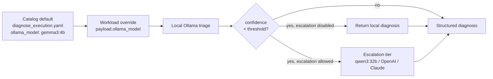

# Triage Model Selection

NoETL's self-troubleshoot path uses a local Ollama model first and
escalates only when confidence is too low. Keep those two choices
separate:

- the **default triage model** is the model used for the first local
  diagnosis attempt;
- the **escalation tier** is invoked only when the first-pass diagnosis
  is not confident enough and the workload allows escalation.

## Default: `gemma3:4b`

`gemma3:4b` is the default first-pass model for the troubleshoot agent.
It is the right default for local kind clusters, developer laptops, and
memory-constrained worker nodes because it fits in roughly 4 GiB total
memory while still producing reliable structured JSON for known failure
patterns.

```bash
ollama pull gemma3:4b
```

Use the [Gemma 3 Ollama library page](https://ollama.com/library/gemma3)
and select the `4b` tag. This is the model validated across the
NoETL-as-AI-OS evidence trail from v2.35.3 through v2.35.9. The spike
e2e workflow, auto-troubleshoot smoke, optional-AI smoke, and
live-vs-persisted parity smoke all assume this remains safe for
commodity local clusters.

For this local backend, `diagnosis_lookup.attempts == 0` is typical,
`1` is an occasional timing race, and anything above `1` should be
treated as a regression signal.

Do not replace the catalog default just because a larger model is
available. The default needs to run where NoETL itself is being
developed and debugged.

## Higher-quality opt-in: `gemma4:e4b`

`gemma4:e4b` is a higher-quality local model for production
deployments with dedicated memory for Ollama. It is an opt-in workload
override, not the catalog default.

```bash
ollama pull gemma4:e4b
```

See the [Gemma 4 e4b Ollama library page](https://ollama.com/library/gemma4:e4b).

Memory profile measured on 2026-05-06:

| Measurement | Value |
|---|---:|
| Resident model after pull/load | ~9.4 GiB |
| Additional inference working set | ~9.8 GiB |
| Practical cgroup requirement | ~20 GiB |
| Local kind-on-Podman VM floor | ~24 GiB |

The validation attempt that produced this measurement ran on a
16 GiB Podman VM with the Ollama pod temporarily raised to a 12 GiB
cgroup limit. The model loaded, but inference failed:

```text
model requires more system memory (9.8 GiB) than is available (3.3 GiB)
```

That message is easy to misread. Ollama is reporting the **additional**
memory the inference pass needs on top of the already-loaded model, not
the total memory needed for the model. If you see "needs 9.8 GiB
available" while the model is already resident in a 12 GiB cgroup, you
do not need 12 GiB total; you need roughly 20 GiB of room for the
resident model plus the inference working set.

Use `gemma4:e4b` for production clusters with a dedicated Ollama node
or pod budget. Good fits include GKE node pools with at least 24 GiB
allocated to Ollama, EKS `m6i.2xlarge`-class nodes or larger, or
self-managed clusters with dedicated AI nodes.

Because this is still an in-cluster local backend, its persisted
diagnosis should usually arrive within `0` to `1`
`diagnosis_lookup.attempts`; sustained values above `1` deserve
investigation.

Workloads opt in by passing `ollama_model: "gemma4:e4b"`:

```bash
noetl exec tests/spike/spike_e2e_test \
  --runtime distributed \
  --payload '{"escalate_to":"none","ollama_model":"gemma4:e4b"}'
```

Leave the catalog default as `gemma3:4b`; larger-model use should be
intentional per workload or per environment.

## Escalation tier: `qwen3:32b`

`qwen3:32b` is the local heavyweight tier for cases where the first
model returns low confidence and the workload allows escalation. It is
roughly a 19 GiB model, so it belongs on production-grade Ollama nodes,
not small local clusters.

This is a different axis from choosing the default model:

- default-model choice decides which model tries first;
- escalation decides what happens when that first answer is not
  confident enough.

The troubleshoot agent escalates when:

1. the parsed local diagnosis has `confidence < confidence_threshold`;
2. `escalate_to` allows a second pass, such as `ollama`, `openai`, or
   `claude`;
3. the required model or credential is available.

If escalation is disabled with `escalate_to: "none"`, the agent returns
the local diagnosis even when confidence is low.

Escalation calls can be slower than the local default. Cloud escalation
backends should be interpreted with the same latency profile documented
for Vertex AI: `0` to `3` `diagnosis_lookup.attempts` is normal, up to
about `5` can be acceptable on a slow network, and sustained values
above `5` should be investigated.

## How the choice flows

For GKE deployments that use a cloud-managed backend instead of
in-cluster Ollama, see
[Vertex AI Triage Backend](./vertex_ai_triage_backend.md). That page
documents the MCP pointer-swap contract and the `triage_mcp_server` /
`triage_model` workload names. The validated GKE production analogue
for the default tier is `gemini-2.5-flash`; see the
[Model availability and the 404 troubleshooting note](./vertex_ai_triage_backend.md#model-availability-and-the-404-troubleshooting-note)
for why earlier `gemini-2.0-flash` examples hit 404 and were retired for this
project.

When that backend is `mcp/vertex-ai`, the expected polling profile is
wider than local Ollama: `0` to `3` `diagnosis_lookup.attempts` is
normal and up to about `5` can be acceptable on slow networks. See
[Cloud latency vs local](./vertex_ai_triage_backend.md#cloud-latency-vs-local----diagnosis-fetch-telemetry)
for the measured GKE evidence.



Worked example:

```json
{
  "escalate_to": "none",
  "ollama_model": "gemma4:e4b"
}
```

This payload asks the spike e2e workflow to use `gemma4:e4b` for the
local diagnosis only. Because `escalate_to` is `none`, a low-confidence
answer still returns from the local model and does not call the
escalation tier.

## Operational notes

- The default Ollama pod budget was raised after ops#38 because 4 GiB
  was too small for reliable `gemma3:4b` inference. The local default is
  now a 3 GiB request and 5 GiB limit.
- Local kind development uses Podman only. The Podman machine must mount
  the shared checkout path, including `/Volumes:/Volumes` on macOS, so
  kind can read manifests and local automation paths.
- Run Podman and kind commands with `XDG_DATA_HOME` unset when the
  machine was created that way; otherwise the CLI can look at the wrong
  machine metadata.
- Do not use Colima for the NoETL local kind workflow. Keep the
  Podman-backed `kind-noetl` path deterministic.
- The 2026-05-06 `gemma4:e4b` validation result is recorded in
  `bridge/outbox/20260506-025752-option-b-gemma4-evidence-doc-coverage.result.json`
  in the `ai-meta` repository. Treat its cgroup math as the current
  sizing floor until a larger local VM or production node proves a new
  lower bound.
