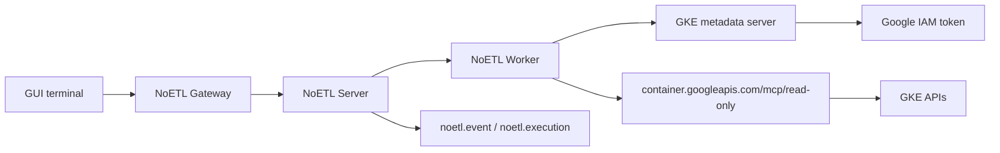

# Google Managed GKE MCP Service

NoETL can use Google's managed GKE MCP endpoint as a remote read-only MCP
service. The GUI never calls Google directly. The GUI terminal starts a NoETL
agent playbook, the worker calls the managed MCP endpoint, and every action is
recorded as a normal NoETL execution.

## Architecture



The managed endpoint is:

```text
https://container.googleapis.com/mcp/read-only
```

Catalog resources:

| Path | Kind | File in `repos/ops` |
|---|---|---|
| `mcp/gcp/gke` | `playbook` | `automation/agents/gcp/runtime.yaml` |
| `mcp/gcp` | `mcp` | `automation/agents/gcp/templates/mcp_gke_managed.yaml` |

## Required IAM

Bind the NoETL worker Kubernetes service account to a Google service account
through Workload Identity. The Google service account needs both roles:

| Role | Why it is required |
|---|---|
| `roles/container.viewer` | Read-only GKE inventory permissions such as `container.clusters.list`. |
| `roles/mcp.toolUser` | `mcp.tools.call` permission required by Google-managed MCP `tools/call`. |

Without `roles/mcp.toolUser`, `tools` can still list tool metadata, but
`call list_clusters ...` fails with:

```text
Permission 'mcp.googleapis.com/tools.call' denied on resource
```

After changing IAM bindings, restart `deployment/noetl-worker` so fresh metadata
tokens pick up the new permissions.

## Register The Service

```bash
cd /Volumes/X10/projects/noetl/ai-meta/repos/ops

noetl --host localhost --port 18082 catalog register \
  automation/agents/gcp/runtime.yaml

noetl --host localhost --port 18082 catalog register \
  automation/agents/gcp/templates/mcp_gke_managed.yaml
```

Register the agent playbook first, then the MCP workspace resource.

## GUI Terminal Usage

Open `https://mestumre.dev` and run:

```text
cd /mcp/gcp
tools
call list_clusters --set parent=projects/noetl-demo-19700101/locations/-
```

Generic MCP tools currently require the `call` prefix. Direct tool names such
as `list_clusters` are not terminal commands yet.

Useful calls:

```text
call get_cluster --set name=projects/noetl-demo-19700101/locations/us-central1/clusters/noetl-cluster
call list_node_pools --set parent=projects/noetl-demo-19700101/locations/us-central1/clusters/noetl-cluster
call get_k8s_cluster_info
call get_k8s_version
call list_k8s_api_resources
```

## Validation

`tools` should show the managed endpoint tools:

```text
gcp tools :: 15
check=1 describe=1 get=8 list=5
```

`call list_clusters ...` should produce an execution whose report includes
`noetl-cluster`.

For a full cluster rebuild procedure, including Cloudflare Pages, Cloudflare
Tunnel, Workload Identity, catalog registration, and smoke tests, see
[Managed GKE MCP Rebuild Runbook](./managed-gke-mcp-rebuild.md).

