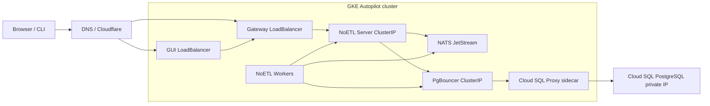

# GKE End-to-End Deployment with Cloud SQL

This page is the operator runbook for deploying the current NoETL stack to
Google Kubernetes Engine using published images and a Cloud SQL PostgreSQL
database. It is intentionally explicit so an engineer can reproduce the
deployment without relying on local image builds.

## Target Architecture



Production rules:

- NoETL Server is internal only: `service/noetl` must be `ClusterIP`.
- Gateway is the public API edge and is Auth0 protected.
- GUI is public static UI and talks to NoETL only through Gateway.
- PostgreSQL is Cloud SQL. App pods connect to `pgbouncer.postgres.svc.cluster.local:5432`.
- PgBouncer reaches Cloud SQL through the Cloud SQL Proxy sidecar using private IP.
- Do not build images locally for GKE release deployments. Use published GHCR images or an Artifact Registry mirror of a published image.

## Current Reference Values

These values describe the live reference deployment used by NoETL maintainers.
Replace domains and IPs for your environment.

| Component | Reference value |
|---|---|
| GCP project | `noetl-demo-19700101` |
| Region | `us-central1` |
| GKE cluster | `noetl-cluster` |
| Cloud SQL instance | `noetl-shared-pg` |
| Cloud SQL version | `POSTGRES_15` |
| Cloud SQL network | private IP only |
| GUI domain | `https://mestumre.dev` |
| Gateway domain | `https://gateway.mestumre.dev` |
| Gateway image | `ghcr.io/noetl/gateway:v2.10.0` |
| NoETL image | `ghcr.io/noetl/noetl:v2.29.0` |
| GUI image | `ghcr.io/noetl/gui:v1.3.2` or an Artifact Registry mirror |

## Prerequisites

Install and authenticate:

```bash
gcloud auth login
gcloud config set project noetl-demo-19700101
gcloud auth application-default login

kubectl version --client
helm version
noetl --version
```

Enable required APIs:

```bash
gcloud services enable \
  artifactregistry.googleapis.com \
  cloudresourcemanager.googleapis.com \
  compute.googleapis.com \
  container.googleapis.com \
  iam.googleapis.com \
  servicenetworking.googleapis.com \
  sqladmin.googleapis.com
```

Clone the split repositories in the standard `ai-meta` layout:

```bash
git clone git@github.com:noetl/ai-meta.git
cd ai-meta
git submodule sync --recursive
git submodule update --init --recursive
```

## Auth0 Requirements

Login should work when both the deployed runtime config and the Auth0
application settings agree.

GUI runtime config must include:

```text
VITE_API_MODE=gateway
VITE_API_BASE_URL=https://gateway.example.com/noetl
VITE_ALLOW_SKIP_AUTH=false
VITE_GATEWAY_URL=https://gateway.example.com
VITE_AUTH0_DOMAIN=<tenant>.auth0.com
VITE_AUTH0_CLIENT_ID=<spa-client-id>
VITE_AUTH0_REDIRECT_URI=https://gui.example.com/login
```

In the Auth0 SPA application, set:

```text
Allowed Callback URLs:
  https://gui.example.com/login

Allowed Logout URLs:
  https://gui.example.com
  https://gui.example.com/login

Allowed Web Origins:
  https://gui.example.com

Allowed Origins (CORS):
  https://gui.example.com
  https://gateway.example.com
```

For the reference deployment this means:

```text
https://mestumre.dev/login
https://mestumre.dev
https://gateway.mestumre.dev
```

## DNS Requirements

Create public DNS records before validating browser login:

```text
A  gateway.example.com  <gateway-load-balancer-ip>
A  gui.example.com      <gui-load-balancer-ip>
```

If Cloudflare proxying is enabled, use an SSL mode compatible with the
backend. For a plain GKE `LoadBalancer` service on port 80, Cloudflare
terminates HTTPS at the edge and forwards HTTP to the load balancer.

## Cloud SQL Specification

The recommended deployment uses one Cloud SQL PostgreSQL instance with two
databases:

| Database | Owner/user | Purpose |
|---|---|---|
| `noetl` | `noetl` | NoETL catalog, command, event, execution projections |
| `demo_noetl` | `demo`, `auth` | Example playbook data and Auth0 system playbooks |

The Cloud SQL instance should be private-IP reachable from the GKE VPC. The
deployment playbook can create or reuse the instance.

Core settings:

```text
use_cloud_sql=true
cloud_sql_enable_private_ip=true
cloud_sql_enable_public_ip=false
pgbouncer_enabled=true
deploy_postgres=false
postgres_host=pgbouncer.postgres.svc.cluster.local
postgres_port=5432
```

PgBouncer runs in the `postgres` namespace with a Cloud SQL Proxy sidecar:

```text
service/pgbouncer.postgres.svc.cluster.local:5432
  -> pgbouncer container
  -> 127.0.0.1:6432
  -> cloud-sql-proxy --private-ip
  -> Cloud SQL PostgreSQL
```

## Deployment Command

Run from `repos/ops`:

```bash
cd /path/to/ai-meta/repos/ops

noetl run automation/gcp_gke/noetl_gke_fresh_stack.yaml \
  --set action=deploy \
  --set project_id=noetl-demo-19700101 \
  --set region=us-central1 \
  --set cluster_name=noetl-cluster \
  --set build_images=false \
  --set build_noetl_image=false \
  --set build_gateway_image=false \
  --set build_gui_image=false \
  --set use_cloud_sql=true \
  --set cloud_sql_instance_name=noetl-shared-pg \
  --set cloud_sql_enable_private_ip=true \
  --set cloud_sql_enable_public_ip=false \
  --set pgbouncer_enabled=true \
  --set deploy_postgres=false \
  --set reapply_noetl_schema=true \
  --set deploy_clickhouse=false \
  --set deploy_ingress=false \
  --set noetl_image_repository=ghcr.io/noetl/noetl \
  --set noetl_image_tag=v2.29.0 \
  --set gateway_image_repository=ghcr.io/noetl/gateway \
  --set gateway_image_tag=v2.10.0 \
  --set gui_image_repository=ghcr.io/noetl/gui \
  --set gui_image_tag=v1.3.2 \
  --set gateway_service_type=LoadBalancer \
  --set gateway_load_balancer_ip=<gateway-static-ip> \
  --set gateway_public_host=gateway.example.com \
  --set gateway_public_url=https://gateway.example.com \
  --set gateway_auth_bypass=false \
  --set gui_service_type=LoadBalancer \
  --set gui_load_balancer_ip=<gui-static-ip> \
  --set gui_public_host=gui.example.com \
  --set gui_gateway_public_url=https://gateway.example.com \
  --set gateway_cors_allowed_origins="https://gui.example.com,https://gateway.example.com" \
  --set bootstrap_gateway_auth=true
```

Use existing static IPs when reusing a deployment. If a GHCR package is private,
either make it public or mirror the exact published image into Artifact Registry
and deploy the mirror. Do not rebuild source just to work around package
visibility.

## What the Playbook Must Do

The GKE deployment playbook is expected to perform these steps:

1. Validate GCP project, cluster, repository paths, DNS mode, and image inputs.
2. Create or reuse the GKE Autopilot cluster.
3. Create or reuse the Cloud SQL PostgreSQL instance.
4. Ensure private service access for Cloud SQL private IP.
5. Ensure Cloud SQL databases and users exist.
6. Deploy PgBouncer with a Cloud SQL Proxy sidecar.
7. Apply the NoETL PostgreSQL DDL through PgBouncer.
8. Deploy NATS.
9. Deploy NoETL Server and NoETL Workers with ClusterIP-only API service.
10. Register Auth0 credentials and system playbooks.
11. Execute the auth schema provisioning playbook.
12. Deploy Gateway with `authBypass=false`.
13. Deploy GUI in gateway mode with `allow_skip_auth=false`.
14. Verify external DNS, service health, and authenticated proxy behavior.

## Post-Deployment Verification

Set cluster context:

```bash
gcloud container clusters get-credentials noetl-cluster \
  --region us-central1 \
  --project noetl-demo-19700101
```

Verify images and service exposure:

```bash
kubectl -n noetl get deploy noetl-server noetl-worker -o wide
kubectl -n gateway get deploy gateway -o wide
kubectl -n gui get deploy gui -o wide

kubectl get svc -A | rg 'noetl|gateway|gui|pgbouncer'
```

Expected:

```text
noetl/noetl        ClusterIP   <none>
postgres/pgbouncer ClusterIP  <none>
gateway/gateway   LoadBalancer <gateway-ip>
gui/gui           LoadBalancer <gui-ip>
```

Verify NoETL internal health:

```bash
kubectl -n noetl port-forward svc/noetl 18082:8082
curl -fsS http://localhost:18082/api/health
```

Expected:

```json
{"status":"ok"}
```

Verify Gateway public health:

```bash
curl -fsS https://gateway.example.com/health
```

Expected:

```text
ok
```

Verify Gateway protects the NoETL proxy path:

```bash
curl -sSI https://gateway.example.com/noetl/api/health | head
```

Expected without a session:

```text
HTTP/2 401
```

Verify GUI runtime config:

```bash
curl -fsS http://<gui-load-balancer-ip>/env-config.js
```

Expected:

```js
window.__NOETL_ENV__ = {
  "VITE_API_MODE": "gateway",
  "VITE_API_BASE_URL": "https://gateway.example.com/noetl",
  "VITE_ALLOW_SKIP_AUTH": "false",
  "VITE_GATEWAY_URL": "https://gateway.example.com",
  "VITE_AUTH0_REDIRECT_URI": "https://gui.example.com/login"
};
```

Verify Cloud SQL path:

```bash
kubectl -n postgres get deploy pgbouncer -o yaml | rg -- '--private-ip|cloud-sql-proxy|--port='
kubectl -n noetl get configmap noetl-server-config \
  -o jsonpath='{.data.POSTGRES_HOST}{"\n"}{.data.POSTGRES_PORT}{"\n"}'
```

Expected:

```text
pgbouncer.postgres.svc.cluster.local
5432
```

## Auth and Login Smoke Test

Browser login is healthy when all of these are true:

1. `https://gui.example.com` loads the GUI.
2. `/env-config.js` has gateway mode and `VITE_ALLOW_SKIP_AUTH=false`.
3. Auth0 redirects back to `https://gui.example.com/login`.
4. Gateway `/health` returns `ok`.
5. Gateway `/noetl/api/*` returns `401` without a session and succeeds with a valid session.
6. Auth system playbooks are registered and `auth.sessions` receives a session row after login.

Useful checks:

```bash
kubectl -n gateway logs deploy/gateway --tail=100
kubectl -n noetl logs deploy/noetl-server --tail=100
kubectl -n noetl logs deploy/noetl-worker --tail=100
```

If login redirects but the app remains unauthenticated, check:

- Auth0 callback/web-origin settings.
- Gateway CORS origins.
- Auth0 system playbook registration.
- `pg_auth` credential points to PgBouncer.
- `auth.sessions`, `auth.users`, and `auth.user_roles` exist in Cloud SQL.

## Register MCP Kubernetes Content

After the core stack is healthy, register MCP resources and lifecycle
playbooks through the NoETL API or authenticated gateway path. The catalog
entries should include resource kinds such as `mcp`, `agent`, and `playbook`.

For the Kubernetes MCP workspace, register the lifecycle agents and MCP
template from `repos/ops`:

```bash
cd /path/to/ai-meta/repos/ops

for f in \
  automation/agents/kubernetes/lifecycle/deploy.yaml \
  automation/agents/kubernetes/lifecycle/undeploy.yaml \
  automation/agents/kubernetes/lifecycle/redeploy.yaml \
  automation/agents/kubernetes/lifecycle/restart.yaml \
  automation/agents/kubernetes/lifecycle/status.yaml \
  automation/agents/kubernetes/lifecycle/discover.yaml \
  automation/agents/kubernetes/templates/mcp_kubernetes.yaml
do
  noetl catalog register "$f"
done
```

The GUI terminal should then discover registered MCP scopes, for example:

```text
noetl@cluster:/mcp$
cd /mcp/kubernetes
status
pods
services
events
```

For Google Cloud's managed GKE MCP endpoint, register the remote-managed
resource and agent instead of deploying an in-cluster MCP server:

```bash
cd /path/to/ai-meta/repos/ops

noetl catalog register automation/agents/gcp/runtime.yaml
noetl catalog register automation/agents/gcp/templates/mcp_gke_managed.yaml
```

Then bind the NoETL worker service account to a Google service account with
`roles/container.viewer` and `roles/mcp.toolUser` so the worker can obtain a
token through Workload Identity and invoke Google-managed MCP tools. The GUI
terminal discovers this as `/mcp/gcp`:

```text
cd /mcp/gcp
status
tools
call list_clusters --set parent=projects/<project-id>/locations/-
```

See [Managed GKE MCP Rebuild Runbook](./gke-managed-gcp-mcp-rebuild.md)
for exact IAM, registration, worker restart, and validation commands.

## Internet Exposure Model

The preferred production shape is:

- GUI is static and public on Cloudflare Pages or an equivalent static host.
- Gateway is the only public API surface.
- NoETL server, workers, NATS, PgBouncer, Cloud SQL, and MCP services are not
  internet-addressable.

This keeps the browser-facing assets close to users while the GKE cluster
remains an internal execution fabric.

### Option A: GUI on Cloudflare Pages, Gateway in GKE

Use this when you want the least deployment change from the current
`mestumre.dev` setup:

1. Build `repos/gui` with gateway mode.
2. Deploy the static `dist/` output to Cloudflare Pages.
3. Configure GUI runtime env:

```javascript
window.__NOETL_ENV__ = {
  VITE_API_MODE: "gateway",
  VITE_API_BASE_URL: "https://gateway.example.com/noetl",
  VITE_GATEWAY_URL: "https://gateway.example.com",
  VITE_ALLOW_SKIP_AUTH: "false",
  VITE_AUTH0_REDIRECT_URI: "https://app.example.com/login"
};
```

4. Expose only the Gateway service publicly. Keep `noetl/noetl` as
   `ClusterIP` and do not create a public Ingress or LoadBalancer for it.
5. Set Gateway CORS to the Cloudflare Pages origin:

```text
CORS_ALLOWED_ORIGINS=https://app.example.com,https://gateway.example.com
NOETL_BASE_URL=http://noetl.noetl.svc.cluster.local:8082
GATEWAY_AUTH_BYPASS=false
```

### Option B: GUI on Cloudflare Pages, Gateway on Cloud Run

Use this when the GKE cluster should have no public Services at all:

1. Deploy Gateway to Cloud Run with `GATEWAY_AUTH_BYPASS=false`.
2. Give Cloud Run private egress to the VPC that contains the GKE cluster.
   Google Cloud supports Cloud Run egress to VPC networks through Direct VPC
   egress or Serverless VPC Access.
3. Expose NoETL inside GKE through an internal-only endpoint reachable from
   that VPC, such as an internal LoadBalancer service.
4. Point Gateway at the internal NoETL address:

```text
NOETL_BASE_URL=http://<internal-noetl-address>:8082
CORS_ALLOWED_ORIGINS=https://app.example.com,https://gateway.example.com
GATEWAY_PUBLIC_URL=https://gateway.example.com
```

5. Keep GUI runtime pointing at the public Gateway URL, never at NoETL.

This option gives the cleanest isolation boundary: Cloudflare serves GUI,
Cloud Run authenticates and proxies, and GKE remains private runtime only.

### Exposure checks

After deployment, this should be true:

```bash
kubectl -n noetl get svc noetl
kubectl -n noetl get ingress
kubectl -n gui get svc,ingress
kubectl -n gateway get svc,ingress
```

Expected:

- `noetl/noetl` is `ClusterIP`
- no public Ingress in `noetl`
- no public GUI service when the GUI is on Cloudflare Pages
- exactly one public Gateway endpoint, or none in GKE when Gateway is on Cloud Run

## Rollback

Gateway:

```bash
helm -n gateway history noetl-gateway
helm -n gateway rollback noetl-gateway <revision>
kubectl -n gateway rollout status deployment/gateway
```

NoETL:

```bash
helm -n noetl history noetl
helm -n noetl rollback noetl <revision>
kubectl -n noetl rollout status deployment/noetl-server
kubectl -n noetl rollout status deployment/noetl-worker
```

GUI:

```bash
helm -n gui history noetl-gui
helm -n gui rollback noetl-gui <revision>
kubectl -n gui rollout status deployment/gui
```

## Troubleshooting

### GKE cannot pull a GHCR image

Symptom:

```text
failed to fetch anonymous token ... ghcr.io/token ... 401 Unauthorized
```

Fix:

- Make the GHCR package public, or
- configure an image pull secret, or
- mirror the exact published image to Artifact Registry and deploy the mirror.

Do not rebuild the image locally unless the goal is to test new source.

### Gateway `/noetl/api/health` returns 401

This is expected when `authBypass=false` and the request has no valid session.
Use `/health` for unauthenticated Gateway liveness.

### GUI login redirects to Auth0 but does not return

Check Auth0 application settings:

- Allowed Callback URLs include `https://gui.example.com/login`.
- Allowed Web Origins include `https://gui.example.com`.
- Allowed Origins (CORS) include the GUI and Gateway origins.

### Auth succeeds but API calls fail

Check:

```bash
kubectl -n gateway logs deploy/gateway --tail=100
kubectl -n noetl logs deploy/noetl-server --tail=100
kubectl -n noetl logs deploy/noetl-worker --tail=100
```

Common causes:

- Auth playbooks were not registered.
- `pg_auth` points to a stale database host.
- Auth schema was not provisioned in Cloud SQL.
- Gateway CORS does not include the GUI origin.

## Related Documentation

- [Current GCP Setup and System Playbook Architecture](./gcp-current-setup-system-playbooks)
- [GCP Cloud SQL via PgBouncer and Cloud SQL Proxy](./gcp-cloudsql-pgbouncer-private-ip)
- [Gateway Auth0 Setup](../gateway/auth0-setup)
- [Gateway Deployment Guide](../gateway/deployment-guide)
- [MCP End-to-End on GKE](./mcp-end-to-end-gke)
