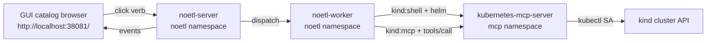

# MCP End-to-End on Local Kind

Step-by-step bring-up of the full NoETL stack on a local
[kind](https://kind.sigs.k8s.io/) cluster, ending with a
**`kubernetes-mcp-server`** pod reachable from the GUI's friendly
run dialog. After this guide finishes you'll be able to open
`http://localhost:38081/`, click `mcp/kubernetes` → `pods`, and see
real cluster state stream back through the GUI.

The architecture this guide deploys is described in detail under
[NoETL Catalog-Driven MCP Architecture](../../architecture/mcp_catalog_architecture.md).

## What you end up with



| Pod | Namespace | Image |
|---|---|---|
| `noetl-server` | `noetl` | `ghcr.io/noetl/noetl:v2.29.x` (or later) |
| `noetl-worker` | `noetl` | same |
| `noetl-gui` | `gui` | `ghcr.io/noetl/gui:v1.3.x` |
| `kubernetes-mcp-server` | `mcp` | `quay.io/containers/kubernetes_mcp_server:v0.0.61` |
| `postgres` | `postgres` | upstream postgres |
| `nats` | `nats` | upstream nats |

## Prerequisites

| Tool | Version | macOS install |
|---|---|---|
| podman (or Docker Desktop) | ≥ 4 | `brew install podman` then `podman machine init && podman machine start` |
| kind | ≥ 0.20 | `brew install kind` |
| kubectl | ≥ 1.27 | `brew install kubectl` |
| helm | ≥ 3.13 | `brew install helm` |
| gh | ≥ 2.40 | `brew install gh` |
| noetl CLI (rust) | latest | `brew install noetl/tap/noetl` (or build from `repos/cli`) |

Repositories — clone the AI-meta monorepo with submodules:

```bash
git clone --recurse-submodules git@github.com:noetl/ai-meta.git
cd ai-meta
git submodule update --init --recursive
```

After this, you have:

- `repos/noetl` — server / worker source + manifests
- `repos/ops`   — automation playbooks (kind bootstrap, deploy helpers, MCP lifecycle agents)
- `repos/gui`   — web UI source

## Step 1 — Create the kind cluster

The cluster config in `repos/ops/ci/kind/config.yaml` ships the
nodePort mappings (8082 noetl, 38081 gui, 30888 superset, etc.) and
hostPath mounts that survive cluster recreations:

```bash
cd ai-meta/repos/ops
kind create cluster --config=ci/kind/config.yaml
kubectl config use-context kind-noetl
kubectl cluster-info
```

Expected: `kind-noetl` shows as the active context, `cluster-info`
returns the control-plane URL, and `kubectl get nodes` shows one
`noetl-control-plane` node.

## Step 2 — Bootstrap postgres + nats

These are dependencies of the noetl server. Apply the manifests:

```bash
cd ai-meta/repos/noetl

# Postgres
kubectl apply -f ci/manifests/postgres/namespace/namespace.yaml
kubectl create configmap postgres-schema-ddl \
  --namespace postgres \
  --from-file=schema_ddl.sql.norun=noetl/database/ddl/postgres/schema_ddl.sql \
  --dry-run=client -o yaml | kubectl apply -f -
kubectl apply -f ci/manifests/postgres/

# NATS
kubectl apply -f ci/manifests/nats/

kubectl rollout status deployment/postgres -n postgres --timeout=180s
kubectl rollout status statefulset/nats -n nats --timeout=180s
```

## Step 3 — Deploy noetl from the registry image

Use the latest published image — no local source build needed:

```bash
NOETL_TAG=$(gh release list --repo noetl/noetl --limit 1 --json tagName -q '.[0].tagName')
echo "Deploying ${NOETL_TAG}"

# Apply namespace + RBAC + manifests
kubectl apply -f ci/manifests/noetl/namespace/
if ! kubectl get secret gcs-credentials -n noetl >/dev/null 2>&1; then
  kubectl create secret generic gcs-credentials -n noetl --from-literal=gcs-key.json='{}'
fi
kubectl apply -f ci/manifests/noetl/rbac.yaml

# Substitute the image placeholder and apply
TARGET_IMAGE="ghcr.io/noetl/noetl:${NOETL_TAG}"
for manifest in ci/manifests/noetl/*.yaml; do
  if [ -f "$manifest" ]; then
    sed -e "s|image_name:image_tag|${TARGET_IMAGE}|g" "$manifest" | kubectl apply -f -
  fi
done

# imagePullPolicy=Always so kind actually pulls from ghcr
for d in noetl-server noetl-worker; do
  for c in $(kubectl -n noetl get deployment "$d" -o jsonpath='{.spec.template.spec.containers[*].name}'); do
    kubectl -n noetl patch deployment "$d" --type=strategic -p \
      "{\"spec\":{\"template\":{\"spec\":{\"containers\":[{\"name\":\"${c}\",\"imagePullPolicy\":\"Always\"}]}}}}"
  done
done
kubectl -n noetl rollout status deployment/noetl-server --timeout=240s
kubectl -n noetl rollout status deployment/noetl-worker --timeout=240s
```

## Step 4 — Port-forward and health-check

```bash
kubectl -n noetl port-forward svc/noetl 8082:8082 > /tmp/noetl-pf.log 2>&1 &
sleep 2
curl -fsS http://localhost:8082/api/health && echo "  noetl reachable"
```

Expected: `{"status":"ok"}`.

## Step 5 — Deploy the GUI

```bash
cd ai-meta/repos/ops
GUI_TAG=$(gh release list --repo noetl/gui --limit 1 --json tagName -q '.[0].tagName')
echo "Deploying gui ${GUI_TAG}"

noetl run automation/development/gui.yaml --runtime local \
  --set action=deploy \
  --set image_repository=ghcr.io/noetl/gui \
  --set image_tag="${GUI_TAG}" \
  --set image_pull_policy=Always \
  --set api_base_url=http://localhost:8082 \
  --set allow_skip_auth=true

# Watch the rollout (deployment is named `gui`, not `noetl-gui`)
kubectl -n gui rollout status deployment/gui --timeout=180s
```

Open the GUI at `http://localhost:38081/` — you should land in the
catalog browser.

## Step 6 — Register the MCP catalog content

The lifecycle agents and the curated `mcp_kubernetes.yaml` template
ship in `repos/ops` and need to be registered into the running
catalog:

```bash
cd ai-meta/repos/ops
for f in \
  automation/agents/kubernetes/runtime.yaml \
  automation/agents/kubernetes/lifecycle/deploy.yaml \
  automation/agents/kubernetes/lifecycle/undeploy.yaml \
  automation/agents/kubernetes/lifecycle/redeploy.yaml \
  automation/agents/kubernetes/lifecycle/restart.yaml \
  automation/agents/kubernetes/lifecycle/status.yaml \
  automation/agents/kubernetes/lifecycle/discover.yaml \
  automation/agents/kubernetes/templates/mcp_kubernetes.yaml ; do
  echo "=== $f ==="
  noetl catalog register "$f"
done
```

Expected: each call returns `version 1 registered` (or higher on
re-runs). The Mcp template registers as `kind: mcp`; everything else
as `kind: playbook`.

## Step 7 — Deploy the Kubernetes MCP server via lifecycle.deploy

This is the dispatcher path — every wire from catalog browser
through to a real cluster effect:

```bash
DEPLOY_RESP=$(curl -s -X POST http://localhost:8082/api/mcp/mcp/kubernetes/lifecycle/deploy \
  -H "Content-Type: application/json" -d '{}')
echo "$DEPLOY_RESP" | python3 -m json.tool
DEPLOY_EXEC=$(echo "$DEPLOY_RESP" | python3 -c 'import json,sys; print(json.load(sys.stdin)["execution_id"])')
sleep 75
kubectl -n mcp get all
```

Expected:
- `deployment.apps/kubernetes-mcp-server` Available 1/1
- `pod/kubernetes-mcp-server-...` Running
- `service/kubernetes-mcp-server` ClusterIP

## Step 8 — Bind cluster-read RBAC for the MCP server SA

The kubernetes-mcp-server reads pods/events/etc across the cluster
through its own service account. Until [this is baked into the
chart values](https://github.com/noetl/noetl/issues), bind a
read-only ClusterRole to it manually:

```bash
cat <<'YAML' | kubectl apply -f -
apiVersion: rbac.authorization.k8s.io/v1
kind: ClusterRole
metadata:
  name: kubernetes-mcp-server-reader
rules:
  - apiGroups: [""]
    resources: ["namespaces", "nodes", "pods", "pods/log", "services", "endpoints", "persistentvolumeclaims", "configmaps", "events"]
    verbs: ["get", "list", "watch"]
  - apiGroups: ["apps"]
    resources: ["deployments", "replicasets", "statefulsets", "daemonsets"]
    verbs: ["get", "list", "watch"]
  - apiGroups: ["batch"]
    resources: ["jobs", "cronjobs"]
    verbs: ["get", "list", "watch"]
  - apiGroups: ["events.k8s.io"]
    resources: ["events"]
    verbs: ["get", "list", "watch"]
  - apiGroups: ["metrics.k8s.io"]
    resources: ["pods", "nodes"]
    verbs: ["get", "list"]
---
apiVersion: rbac.authorization.k8s.io/v1
kind: ClusterRoleBinding
metadata:
  name: kubernetes-mcp-server-reader
subjects:
  - kind: ServiceAccount
    name: kubernetes-mcp-server
    namespace: mcp
roleRef:
  kind: ClusterRole
  name: kubernetes-mcp-server-reader
  apiGroup: rbac.authorization.k8s.io
YAML

kubectl auth can-i list pods --all-namespaces \
  --as=system:serviceaccount:mcp:kubernetes-mcp-server
# Expect: yes
```

## Step 9 — Verify end-to-end from the GUI

1. Open `http://localhost:38081/`.
2. In the prompt, type `cd /mcp/kubernetes` then `ls`.
3. Click the **`pods`** action chip.
4. Wait for the execution to complete — the run dialog shows pod
   data streamed back from the MCP server.
5. Try `namespaces`, `events`, `top`. All should return real
   cluster data.

If you see a permission-denied error from the MCP server, return
to step 8.

## Troubleshooting

### `noetl catalog register` returns connection refused

Your port-forward died. Restart it:

```bash
pkill -f 'kubectl.*port-forward.*noetl' 2>/dev/null
kubectl -n noetl port-forward svc/noetl 8082:8082 > /tmp/noetl-pf.log 2>&1 &
```

### lifecycle.deploy returns `failed: True` but pod is running

Known cosmetic — the helm install completed, the pod is up, but the
agent's post-install assertion reported failure. The MCP server is
usable; track the agent fix in [issue #79](https://github.com/noetl/noetl/issues).

### `cd /mcp/kubernetes && ls` doesn't work

The GUI prompt parser treats `&&` as part of the cd argument. Use
two commands separated by an Enter press until the parser is fixed.

### Worker fails with `Tool kind 'shell' not implemented`

You're on a noetl image older than v2.29.0. Roll forward.

### `helm: not found` inside the worker

You're on a noetl image older than v2.28.0. Roll forward.

## Related documentation

- [MCP catalog architecture overview](../../architecture/mcp_catalog_architecture.md)
- [GKE deployment guide](./end-to-end-gke.md)
- [Local Kind Deployment (general)](../local-kind/ops-deploy.md)
- [Kubernetes MCP Local Kind Setup (older runbook)](./kubernetes-local-kind.md)
