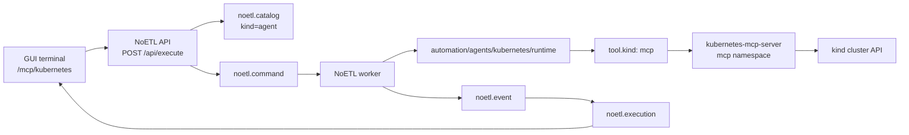

# Kubernetes MCP Local Kind Setup

This runbook deploys the Kubernetes MCP server into a local `kind` cluster and registers the NoETL Kubernetes runtime agent so engineers can operate the cluster from the GUI terminal.

The important rule is that the GUI does not call MCP servers directly. The GUI terminal starts a NoETL agent playbook, the worker calls the MCP server, and NoETL records the activity as a normal execution.



## Components

| Component | Purpose |
|---|---|
| `automation/development/mcp_kubernetes.yaml` | Ops playbook that deploys, checks, or destroys the Kubernetes MCP server. |
| `kubernetes-mcp-server` | MCP HTTP server deployed in namespace `mcp`. |
| `automation/agents/kubernetes/runtime.yaml` | NoETL agent playbook that wraps Kubernetes MCP tool calls. |
| `tool.kind: mcp` | Worker-side bridge that performs MCP `health`, `tools/list`, and `tools/call` requests. |
| `noetl.catalog` | Stores the Kubernetes runtime playbook as `kind = 'agent'`. |
| GUI terminal | Maps commands such as `pods noetl` to agent playbook executions. |

## Prerequisites

- Repositories checked out under the shared workspace:
  - `repos/ops`
  - `repos/noetl`
  - `repos/gui` when validating the GUI locally
- `podman`, `kind`, `kubectl`, `helm`, `jq`, `curl`, and the `noetl` CLI installed.
- Current Kubernetes context is `kind-noetl`.
- A current NoETL server and worker image deployed to the cluster. MCP execution requires NoETL versions that include executable `agent` catalog resources and `tool.kind: mcp`.

## 1. Create or Refresh the Local Cluster

For a first-time cluster:

```bash
cd repos/ops
noetl run automation/infrastructure/kind.yaml --runtime local --set action=create
kubectl config use-context kind-noetl
```

Deploy the base NoETL dependencies and components as described in [Local Kind Deployment](../local-kind/ops-deploy.md). For an existing local cluster, the usual refresh path is:

```bash
cd repos/ops
noetl run automation/development/noetl.yaml \
  --runtime local \
  --set action=redeploy \
  --set noetl_repo_dir=../noetl
```

Verify the API and worker are running:

```bash
kubectl -n noetl get deploy,pods,svc
curl -sS http://localhost:8082/api/health | jq .
```

Expected health response:

```json
{
  "status": "ok"
}
```

## 2. Deploy the Kubernetes MCP Server

Use the ops playbook so every engineer gets the same chart, image, RBAC, and read-only configuration:

```bash
cd repos/ops
noetl run automation/development/mcp_kubernetes.yaml \
  --runtime local \
  --set action=deploy
```

The playbook deploys:

| Setting | Default |
|---|---|
| Namespace | `mcp` |
| Helm release | `kubernetes-mcp-server` |
| Chart | `oci://ghcr.io/containers/charts/kubernetes-mcp-server` |
| Chart version | `0.1.0` |
| Image | `quay.io/containers/kubernetes_mcp_server:v0.0.61` |
| Service | `kubernetes-mcp-server.mcp.svc.cluster.local:8080` |
| MCP endpoint | `http://kubernetes-mcp-server.mcp.svc.cluster.local:8080/mcp` |
| Toolsets | `core,config` |
| Read-only mode | `true` |

Check deployment status:

```bash
cd repos/ops
noetl run automation/development/mcp_kubernetes.yaml \
  --runtime local \
  --set action=status
```

Or use `kubectl` directly:

```bash
kubectl -n mcp get deploy,svc,pods -o wide
kubectl -n mcp rollout status deployment/kubernetes-mcp-server --timeout=180s
```

## 3. Register the Kubernetes Runtime Agent

The Kubernetes runtime agent is a normal NoETL playbook document with `metadata.agent: true`. Register it as an executable catalog resource of type `agent`:

```bash
cd repos/ops
NOETL_API=${NOETL_API:-http://localhost:8082}

jq -Rs '{content: ., resource_type: "agent"}' \
  automation/agents/kubernetes/runtime.yaml \
  > /tmp/noetl-kubernetes-runtime-agent.json

curl -sS "$NOETL_API/api/catalog/register" \
  -H "Content-Type: application/json" \
  --data-binary @/tmp/noetl-kubernetes-runtime-agent.json | jq .
```

Expected response fields include:

```json
{
  "status": "success",
  "path": "automation/agents/kubernetes/runtime",
  "kind": "agent"
}
```

Registering as `agent` is recommended. The GUI terminal discovers registered
agent playbooks from the NoETL catalog and only exposes them in MCP scopes when
they are labeled for terminal use:

```yaml
metadata:
  agent: true
  terminal:
    visible: true
    workspace: kubernetes
    scopes:
      - /mcp/kubernetes
  capabilities:
    - mcp:kubernetes
```

The GUI never connects to `kubernetes-mcp-server` directly. It only calls the
NoETL API. The NoETL worker performs MCP calls from inside the agent execution,
which keeps every operation visible in `noetl.event`, `noetl.command`, and
`noetl.execution`.

## 4. Validate from the NoETL API

Start a tool-list execution:

```bash
NOETL_API=${NOETL_API:-http://localhost:8082}

EXEC_ID=$(
  curl -sS "$NOETL_API/api/execute" \
    -H "Content-Type: application/json" \
    -d '{
      "path": "automation/agents/kubernetes/runtime",
      "resource_kind": "agent",
      "workload": {
        "server": "kubernetes",
        "method": "tools/list",
        "arguments": {}
      }
    }' | jq -r .execution_id
)

echo "$EXEC_ID"
```

Then inspect the execution:

```bash
curl -sS "$NOETL_API/api/executions/$EXEC_ID" | jq '{
  execution_id,
  status,
  path,
  progress,
  error
}'
```

Run a namespace-specific pod list:

```bash
EXEC_ID=$(
  curl -sS "$NOETL_API/api/execute" \
    -H "Content-Type: application/json" \
    -d '{
      "path": "automation/agents/kubernetes/runtime",
      "resource_kind": "agent",
      "workload": {
        "server": "kubernetes",
        "method": "tools/call",
        "tool": "pods_list_in_namespace",
        "arguments": {
          "namespace": "noetl"
        }
      }
    }' | jq -r .execution_id
)

echo "$EXEC_ID"
curl -sS "$NOETL_API/api/executions/$EXEC_ID" | jq '.status, .result, .error'
```

The execution should be visible in the execution dashboard because the call went through NoETL.

## 5. Use the GUI Terminal

Open the GUI and navigate to the MCP workspace:

```text
noetl@kind:/catalog$ cd /mcp
noetl@kind:/mcp$ mcp discover
noetl@kind:/mcp$ cd kubernetes
noetl@kind:/mcp/kubernetes$ status
noetl@kind:/mcp/kubernetes$ tools
noetl@kind:/mcp/kubernetes$ namespaces
noetl@kind:/mcp/kubernetes$ pods noetl
noetl@kind:/mcp/kubernetes$ services
noetl@kind:/mcp/kubernetes$ events noetl
```

The terminal starts executions and returns clickable actions:

```text
started k8s pods :: execution=614039552394527166

open 614039552394527166
report 614039552394527166
```

Use `open <execution_id>` to inspect the execution detail page, or `report <execution_id>` to print the execution summary in the terminal.

## 6. What the Agent Playbook Does

The agent playbook at `automation/agents/kubernetes/runtime` wraps an MCP operation:

```yaml
workflow:
  - step: call_mcp
    tool:
      kind: mcp
      server: "{{ workload.server }}"
      endpoint: "{{ workload.endpoint }}"
      method: "{{ workload.method }}"
      tool: "{{ workload.tool }}"
      arguments: "{{ workload.arguments | tojson }}"
```

The default endpoint is:

```text
http://kubernetes-mcp-server.mcp.svc.cluster.local:8080/mcp
```

The next step normalizes the MCP response into text and structured result fields so the GUI terminal can render either plain text or tables.

## Troubleshooting

| Symptom | Likely Cause | Fix |
|---|---|---|
| `Request failed with status code 422` from the terminal | GUI/API sent an invalid execute payload or omitted `resource_kind: "agent"`. | Use current GUI and NoETL API images; verify the API request follows the examples above. |
| `Executable catalog entry not found` | Agent playbook is not registered or was registered under the wrong kind. | Register `automation/agents/kubernetes/runtime.yaml` with `resource_type: "agent"`. |
| MCP server namespace is missing | Kubernetes MCP deployment has not been applied. | Run `noetl run automation/development/mcp_kubernetes.yaml --runtime local --set action=deploy`. |
| MCP call fails with connection errors | Worker cannot resolve or reach the MCP service. | Check `kubectl -n mcp get svc kubernetes-mcp-server` and use the in-cluster endpoint. |
| Pod metrics fail | The cluster does not have `metrics-server` installed. | Install metrics support or use non-metrics commands such as `pods`, `services`, and `events`. |
| Kubernetes Secrets appear in results | MCP server was deployed without the NoETL read-only/deny configuration. | Redeploy through `automation/development/mcp_kubernetes.yaml`; do not expose Kubernetes Secrets through MCP. |

## Cleanup

Destroy only the MCP server:

```bash
cd repos/ops
noetl run automation/development/mcp_kubernetes.yaml \
  --runtime local \
  --set action=destroy
```

This removes the `mcp` namespace and Helm release. It does not remove NoETL executions that already recorded MCP activity.
