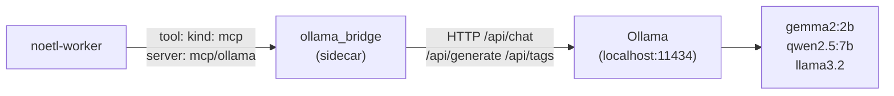

# Ollama Bridge — Local Inference for Playbooks

The Ollama bridge is a thin MCP-protocol JSON-RPC server that fronts
a local [Ollama](https://ollama.com) instance, exposing
`chat` / `generate` / `list_models` as MCP tools. Once registered as
`mcp/ollama` in the catalog, any playbook can call local Gemma /
Qwen / Llama models via the standard `tool: kind: mcp` interface.

This is the cheap-first inference layer for the
[self-troubleshoot agent](../architecture/self_troubleshoot_agent.md):
playbooks call Ollama for first-pass triage and only escalate to
OpenAI / Claude when local results are low-confidence.

For the agent contract this bridge participates in, see
[Agent Orchestration](../architecture/agent_orchestration.md).

## What you end up with



Once deployed, a playbook step looks like:

```yaml
- step: cheap_first_pass
  tool:
    kind: mcp
    server: mcp/ollama
    tool: chat
    arguments:
      model: gemma2:2b
      system: "You triage NoETL execution failures. Be terse."
      messages:
        - role: user
          content: "{{ failure_summary }}"
```

## Tools exposed

| Tool          | What it does                                              |
|---------------|-----------------------------------------------------------|
| `chat`        | Chat completion (`/api/chat`); OpenAI-compatible messages |
| `generate`    | Single-prompt completion (`/api/generate`)                |
| `list_models` | List locally pulled models (`/api/tags`)                  |

The bridge sets `stream: false` on upstream calls and returns the
fully-assembled response. Streaming would require a different
transport (SSE or websocket) and the MCP spec for streaming tool
results is still in flux.

## Tool input schemas

### `chat`

```json
{
  "type": "object",
  "properties": {
    "model": { "type": "string" },
    "messages": {
      "type": "array",
      "items": {
        "type": "object",
        "properties": {
          "role": { "type": "string" },
          "content": { "type": "string" }
        },
        "required": ["role", "content"]
      }
    },
    "temperature": { "type": "number", "default": 0.2 },
    "system": {
      "type": "string",
      "description": "Optional system prompt; prepended to messages if provided"
    }
  },
  "required": ["model", "messages"]
}
```

The optional `system` field is a convenience: when provided, it's
prepended to the messages array as a `{role: "system", content: ...}`
entry. This matches what most callers want without forcing them to
construct the messages array manually.

### `generate`

```json
{
  "type": "object",
  "properties": {
    "model": { "type": "string" },
    "prompt": { "type": "string" },
    "temperature": { "type": "number", "default": 0.2 },
    "system": { "type": "string" }
  },
  "required": ["model", "prompt"]
}
```

### `list_models`

No arguments. Returns a newline-separated list of model tags from
`/api/tags`.

## Response shape

All three tools return the standard MCP content envelope:

```json
{
  "content": [{ "type": "text", "text": "<assembled output>" }],
  "isError": false,
  "_meta": {
    "model": "gemma2:2b",
    "ollama_response": {
      "total_duration": 1234567,
      "eval_count": 7,
      "prompt_eval_count": 12,
      "done": true
    }
  }
}
```

The non-standard `_meta` field carries a compact subset of Ollama's
upstream response (timings, token counts, completion reason) so
callers can log inference stats without parsing the full body. MCP
clients that don't recognize `_meta` ignore it.

### Errors

Upstream Ollama failures (model not pulled, server crashed, etc.)
surface as JSON-RPC error code `-32030` with the upstream URL in
`error.data.upstream_url`:

```json
{
  "jsonrpc": "2.0", "id": 7,
  "error": {
    "code": -32030,
    "message": "ollama /api/chat failed: connection refused",
    "data": { "upstream_url": "http://broken-ollama/api/chat" }
  }
}
```

This distinguishes "tool returned an error" from "transport failure"
— useful for callers deciding whether to retry, escalate, or fall
back.

## Deployment

### Standalone (local dev)

```bash
# Install Ollama, pull a model
brew install ollama
ollama pull gemma2:2b
ollama serve &

# Run the bridge
cd /path/to/noetl
python -m noetl.tools.ollama_bridge
```

The bridge listens on `0.0.0.0:8765` by default (override with
`OLLAMA_BRIDGE_PORT`). It points at `http://localhost:11434`
(override with `OLLAMA_URL`).

### As a sidecar in Kubernetes (Helm)

The noetl Helm chart ships an `ollamaBridge` block that deploys the
bridge as a Deployment + ClusterIP Service in the noetl namespace.
**Disabled by default** — the chart's optional-dependency contract
means a NoETL deployment without AI features keeps working
unchanged. Operators opt in via values:

```yaml
# values-overrides.yaml
ollamaBridge:
  enabled: true
  ollama:
    url: http://ollama.noetl.svc.cluster.local:11434
    timeoutSeconds: 120
  resources:
    requests:
      cpu: "50m"
      memory: "128Mi"
    limits:
      cpu: "500m"
      memory: "512Mi"
```

```bash
helm upgrade --install noetl repos/ops/automation/helm/noetl \
  -n noetl --create-namespace \
  -f values-overrides.yaml
```

What this deploys:

- `Deployment/ollama-bridge` running `python -m noetl.tools.ollama_bridge`
  out of the same noetl image (no separate image; the bridge ships
  in `noetl.tools.ollama_bridge`).
- `Service/ollama-bridge` (ClusterIP, port 8765) reachable in-cluster
  as `ollama-bridge.noetl.svc.cluster.local:8765`.
- `/healthz` readiness + liveness probes matching the bridge's
  built-in healthcheck endpoint.

Override knobs available in the chart values (each falls back to a
sensible default; see `repos/ops/automation/helm/noetl/values.yaml`
for the complete list):

| Values key                          | What it controls                                |
|-------------------------------------|-------------------------------------------------|
| `ollamaBridge.enabled`              | opt-in flag (default `false`)                   |
| `ollamaBridge.replicas`             | bridge pod count (default `1`)                  |
| `ollamaBridge.image.repository`     | override bridge image (default chart image)     |
| `ollamaBridge.image.tag`            | override bridge tag (default chart tag)         |
| `ollamaBridge.service.type`         | `ClusterIP` (default) / `NodePort` / `LB`       |
| `ollamaBridge.service.port`         | bridge port (default `8765`)                    |
| `ollamaBridge.ollama.url`           | upstream Ollama URL                             |
| `ollamaBridge.ollama.timeoutSeconds`| upstream call timeout (default `120`)           |
| `ollamaBridge.resources`            | CPU / memory requests + limits                  |
| `ollamaBridge.nodeSelector`         | for GPU-pinning or AZ-affinity                  |
| `ollamaBridge.tolerations`          | for tainted nodes                               |
| `ollamaBridge.extraEnv`             | extra env vars merged into the container spec   |

### Deploying without Helm (kubectl apply)

If you're not on the chart, the equivalent raw manifests:

```yaml
apiVersion: apps/v1
kind: Deployment
metadata:
  name: ollama-bridge
  namespace: noetl
spec:
  replicas: 1
  selector:
    matchLabels: { app: ollama-bridge }
  template:
    metadata:
      labels: { app: ollama-bridge }
    spec:
      containers:
      - name: ollama-bridge
        image: ghcr.io/noetl/noetl:latest
        command: ["python", "-m", "noetl.tools.ollama_bridge"]
        env:
        - name: OLLAMA_URL
          value: http://ollama.noetl.svc.cluster.local:11434
        - name: OLLAMA_BRIDGE_PORT
          value: "8765"
        ports:
        - containerPort: 8765
        readinessProbe:
          httpGet: { path: /healthz, port: 8765 }
---
apiVersion: v1
kind: Service
metadata:
  name: ollama-bridge
  namespace: noetl
spec:
  selector: { app: ollama-bridge }
  ports:
  - port: 8765
    targetPort: 8765
```

Ollama itself is a separate concern — typically a `StatefulSet` with
a `PersistentVolumeClaim` for the model store, and a NodeSelector
that pins it to GPU nodes when GPU inference is needed. CPU-only
inference works fine for 2B-parameter models on commodity nodes.

## Registering with the catalog

The bridge ships with a catalog template at
`noetl/tools/ollama_bridge/catalog_template.yaml`. Register it once:

```bash
noetl catalog register --type mcp \
  /path/to/noetl/noetl/tools/ollama_bridge/catalog_template.yaml
```

The default `spec.url` points at the in-cluster sidecar service
(`http://ollama-bridge.noetl.svc.cluster.local:8765/jsonrpc`).
Override at registration time for non-default deployments —
the on-disk template is editable.

## Pulling models

The bridge doesn't pre-pull or pre-load models — it assumes the
operator has run `ollama pull <model>` already. The `list_models`
tool exposes what's locally available:

```bash
# Inside the Ollama pod (or your local shell):
ollama pull gemma2:2b
ollama pull qwen2.5:7b
```

`gemma2:2b` is the spike's default — small enough to be fast (~200ms
on commodity CPU), large enough to handle structured-output prompts.
For noisier failures or beefier nodes, `qwen2.5:7b` gives better
classification at ~1s.

## What's not in scope

- **Streaming responses.** Set `stream: false` upstream; assemble +
  return.
- **Per-call auth.** Bridge runs on the cluster's private network;
  expose it with a `NetworkPolicy`, not auth tokens.
- **Caching.** Ollama is fast enough locally; playbooks have their
  own retry/cache layers if they need them.
- **GPU scheduling.** Out of scope for the bridge — that's an
  Ollama-side concern (NodeSelector, runtime class).

## See also

- [Self-Troubleshoot Agent](../architecture/self_troubleshoot_agent.md)
  — the worked example that uses this bridge for cheap-first triage.
- [Agent Orchestration](../architecture/agent_orchestration.md) —
  how MCP tool calls compose with the agent contract.
- [MCP Catalog Architecture](../architecture/mcp_catalog_architecture.md)
  — the higher-level framing for `kind: Mcp` catalog resources.
