# Runtime Reaper and Doctor

NoETL uses two related pieces for self-healing stuck distributed
executions:

- the **in-process command reaper** in the NoETL server, which performs
  automatic recovery;
- **doctor** (`noetl-doctor`), the out-of-process runtime reaper surface
  that monitoring systems and MCP clients can call.

In this documentation, **doctor** means the runtime reaper /
self-healing surface. It is not a generic diagnostic toolkit.

## Responsibilities

The command reaper is the durable correctness mechanism. It runs inside
`deploy/noetl-server`, holds a `RuntimeLease`, scans `noetl.command` for
recoverable non-terminal commands, and republishes command
notifications through NATS. Workers still claim commands through the
normal NoETL command claim API, so `claim_policy` remains the authority
for whether a republished notification becomes executable work.

Doctor is the monitoring-callable wrapper around this system. It is a
small Rust binary that shells out to the `noetl` Rust CLI and runs
bundled NoETL playbooks in local-runtime mode. Doctor can detect stale
rows, inspect one execution, run reachability probes, expose an MCP HTTP
surface, and ask the server to run a command-reaper sweep when that
admin endpoint exists.

Doctor must not write to `noetl.command`, fabricate completion events,
force `loop.done`, or duplicate claim-policy logic. New correctness
rules belong in `repos/noetl`; new monitoring diagnostics belong in
`repos/doctor`.

## Architecture

```mermaid
flowchart LR
  Monitor["Monitoring system or MCP client"] --> Doctor["noetl-doctor"]
  Doctor --> CLI["noetl run --runtime local"]
  CLI --> Playbooks["Bundled doctor playbooks"]
  Playbooks --> API["NoETL HTTP API"]
  Playbooks --> PG["Postgres noetl database"]
  API --> Server["NoETL server"]
  Server --> Reaper["in-process command reaper"]
  Reaper --> NATS["NATS command notifications"]
  NATS --> Workers["NoETL workers"]
  Workers --> Claim["/api/commands/{id}/claim"]
  Claim --> Policy["claim_policy"]
  Policy --> PG
```



## Command Reaper Behavior

The server-side command reaper scans `noetl.command`, not the event log,
for commands attached to executions that have not reached a terminal
event.

It republishes two classes of rows:

- `CLAIMED` or `RUNNING` commands whose worker is missing, non-ready, or
  stale, or whose healthy-worker claim has exceeded the configured hard
  timeout;
- old `PENDING` commands that may have missed their NATS notification.

The reaper does not mark a command complete and does not skip worker
claim arbitration. It only republishes the original command
notification; the regular claim endpoint and claim policy decide the
next state.

Useful environment knobs:

| Variable | Default | Purpose |
| --- | ---: | --- |
| `NOETL_COMMAND_REAPER_ENABLED` | `true` | Enable the server reaper. |
| `NOETL_COMMAND_REAPER_INTERVAL_SECONDS` | `60` | Sweep cadence. |
| `NOETL_COMMAND_REAPER_WORKER_STALE_SECONDS` | `60` | Worker heartbeat stale threshold. |
| `NOETL_COMMAND_REAPER_HEALTHY_HARD_TIMEOUT_SECONDS` | `1800` | Hard timeout even when a worker still appears healthy. |
| `NOETL_COMMAND_REAPER_PENDING_RETRY_SECONDS` | `60` | Age before republishing stranded `PENDING` commands. |
| `NOETL_COMMAND_REAPER_MAX_PER_RUN` | `100` | Maximum rows recovered in one sweep. |

Some deployments also set
`NOETL_COMMAND_CLAIM_HEALTHY_WORKER_HARD_TIMEOUT_SECONDS` so the claim
endpoint and the reaper use the same hard-timeout posture for apparently
healthy workers.

## Doctor CLI

Doctor is implemented in `noetl/doctor` as a Rust crate named
`noetl-doctor`. It bundles YAML playbooks under `playbooks/` and runs
them through:

```bash
noetl run <playbook> --runtime local --set key=value
```

Common commands:

```bash
noetl-doctor detect \
  --noetl-url http://localhost:8082 \
  --pg-dsn postgresql://noetl@localhost:54321/noetl \
  --stale-seconds 300

noetl-doctor reachability \
  --noetl-url http://localhost:8082 \
  --pg-dsn postgresql://noetl@localhost:54321/noetl

noetl-doctor repair trigger-reaper \
  --noetl-url http://localhost:8082

noetl-doctor repair run-playbook ./playbooks/inspect_stale_commands.yaml \
  --set execution_id=627209422065893596 \
  --set pg_dsn=postgresql://noetl@localhost:54321/noetl
```

Exit codes are stable for monitoring:

| Exit code | Meaning |
| ---: | --- |
| `0` | OK or repaired/no-op repair. |
| `2` | Anomaly detected. |
| `3` | Doctor failed to run. |

The CLI always emits JSON shaped like:

```json
{
  "action": "detect",
  "severity": "ok",
  "generated_at": "2026-05-15T13:00:00Z",
  "data": {}
}
```

The exact `data` payload is playbook-specific.

## Bundled Playbooks

Doctor playbooks intentionally use the Rust CLI local-runtime subset.
They are authored as `kind: shell` steps that call `curl`, `psql`, and
`jq`. This keeps doctor independent of server-only tool kinds such as
`postgres`, `python`, or `noop`.

| Playbook | Action | Purpose |
| --- | --- | --- |
| `detect_stuck_executions.yaml` | `detect` | Read-only scan for stuck executions and stale command rows. |
| `inspect_stale_commands.yaml` | `inspect` | Read-only inspection for one execution. |
| `reachability_smoke.yaml` | `probe` | HTTP and Postgres reachability plus worker-pool snapshot. |
| `trigger_command_reaper.yaml` | `trigger` | Best-effort server reaper sweep nudge; 404 is treated as no-op on older servers. |
| `provision_doctor_mcp.yaml` | `deploy`, `redeploy`, `status`, `destroy`, `logs` | Provision the doctor MCP server into Kubernetes. |

Every playbook has a `workload.action` dispatch field and a safe
`help` path for unknown lifecycle actions.

## MCP Surface

When run as an HTTP service:

```bash
noetl-doctor mcp serve --host 0.0.0.0 --port 8765
```

Doctor exposes:

```text
GET  /healthz
GET  /tools
POST /tools/detect/invoke
POST /tools/reachability/invoke
POST /tools/repair_trigger_reaper/invoke
```

Each tool returns the same `Outcome` JSON contract as the CLI.

## Verification

Check that the server-side reaper is alive:

```bash
kubectl -n noetl logs deploy/noetl-server --tail=200 \
  | grep -E "COMMAND-REAPER|RuntimeLease"
```

Expected startup evidence:

```text
[COMMAND-REAPER] Started (interval=..., worker_stale=..., hard_timeout=...)
```

Check the command table after a recovery-sensitive run:

```sql
SELECT status, count(*)
FROM noetl.command
WHERE execution_id = '<execution_id>'
GROUP BY status
ORDER BY status;
```

For a successful run, the final state should not leave `PENDING`,
`CLAIMED`, or `RUNNING` rows.

The PFT v2 validation run on 2026-05-15 proved the recovery path: the
server command reaper twice found 20 orphaned
`fetch_mds_details:task_sequence` commands, republished all 20 each
time, and the execution completed with all 10 facilities validated.
