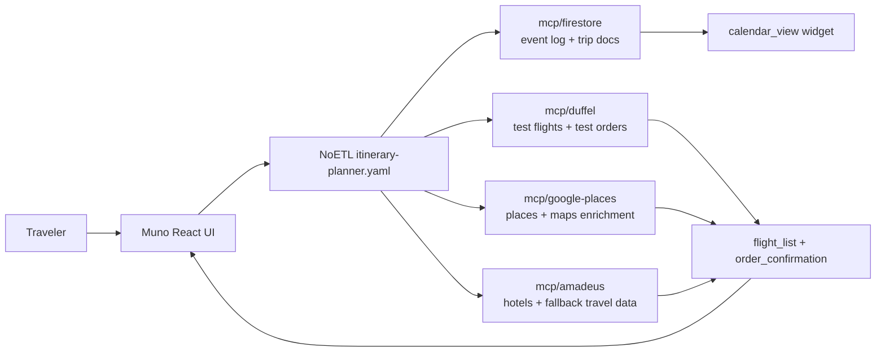

# Tutorial 8 — Trip planner end-to-end

This capstone tutorial walks through the **Adiona/muno** trip-planner
reference app. It connects the pieces built across the trip-planner
rounds: the Muno React UI, the NoETL itinerary-planner playbook,
Firestore event sourcing, Duffel test-environment flights and orders,
Google Places enrichment, Amadeus hotels, and the Material widget
renderer.

Everything in this tutorial is **test environment only**. Duffel orders
use Duffel's test wallet and synthetic offers. Amadeus calls use the
test API unless explicitly overridden elsewhere. The goal is to show the
architecture and developer workflow, not to sell or ticket real travel.


## Vision

Muno is a chat-first trip-planner shell. A traveler can type free-form
requests, submit structured widgets, and gradually build an itinerary.
The frontend stays thin: it validates and renders widget envelopes,
shows trip state, and forwards user turns. The NoETL itinerary agent
does the orchestration work by appending events, dispatching MCP tools,
and choosing the next widget to emit.



The important design point is that every integration is a playbook
boundary. Muno does not know how to call Duffel, Google Places, Amadeus,
or Firestore directly. It renders widget JSON and lets NoETL preserve
the audit trail.

| Round | Deliverable | Proof |
|---|---|---|
| 1 | Duffel test order tools | `create_order` execution `625452830463099795` created booking ref `XKQAYC`. |
| 2 | Duffel Stays decision | Stays was unavailable on the account, so hotels use Amadeus for v1. |
| 3 | Firestore MCP event sourcing | Firestore MCP v6 registered as catalog `625474366091821164`; `append_event` seq smoke passed. |
| 4 | Itinerary agent | Muno PR #1 added `playbooks/itinerary-planner.yaml` and canonical widget examples. |
| 5 | Calendar view | Calendar smoke execution `625590045860168070` rendered `calendar_view` and wrote a Firestore event. |
| 6 | Muno UI + Material widgets | Muno PR #2 replaced JSON stubs with Material UI widgets and a theme. |
| 7 | This tutorial | Screenshots captured from the Muno UI and shipped into docs. |

## Prerequisites

You need a GKE NoETL environment with the trip-planner MCP playbooks
registered. The working project used:

- GCP project `noetl-demo-19700101`.
- GKE cluster `noetl-cluster` in `us-central1`.
- Worker service account
  `noetl-worker-mcp@noetl-demo-19700101.iam.gserviceaccount.com` with
  Workload Identity enabled.
- Firestore Native mode database `(default)` in `us-central1`.
- MCP playbooks registered for `mcp/firestore`, `mcp/duffel`,
  `mcp/google-places`, and `mcp/amadeus`.
- Duffel test token in Secret Manager as `duffel-api-test`.
- Google Maps widget key in Secret Manager as `google-maps-widget-key`.
- Muno cloned locally with dependencies installed.

Credential examples in this tutorial intentionally use placeholders:

```bash
export VITE_GOOGLE_MAPS_KEY="<restricted-widget-api-key>"
export VITE_NOETL_API_BASE_URL="http://localhost:8082/api"
```

For the Google Maps setup model, see the Pattern C reference in ai-meta:
[`playbooks/google-maps-platform-setup-pattern-c.md`](https://github.com/noetl/ai-meta/blob/main/playbooks/google-maps-platform-setup-pattern-c.md).

For the lower-level travel-agent architecture that came before Muno,
start with [Tutorial 7 — Travel agent with widgets](./07-travel-agent-with-widgets.md)
and the visual companion,
[Tutorial 8 — Travel agent GUI walkthrough](./08-travel-agent-gui-walkthrough.md).

## Walkthrough

The screenshots below were captured from a clean local Muno dev session
pointed at the GKE NoETL service through a port-forward:

```bash
kubectl -n noetl port-forward svc/noetl 8082:8082

cd /Volumes/X10/projects/noetl/ai-meta/repos/travel
VITE_NOETL_API_BASE_URL=http://localhost:8082/api \
VITE_GOOGLE_MAPS_KEY="<restricted-widget-api-key>" \
npm run dev -- --host 127.0.0.1 --port 5173
```

Open `http://127.0.0.1:5173/`.

### 1. Starting the chat

The initial Muno shell has three working areas:

- In local demo mode, the left rail can show guest mode and navigation for
  searches and orders. The production site shows a sign-in pane first.
- The center thread holds the assistant turns and widgets.
- The right pane mirrors current trip state, including destination,
  dates, party, budget, star rating, bed type, and amenities as those
  slots become known.

The traveler starts with a simple free-form request: "Find flights to
Paris." In the live agent, that user message is appended to Firestore
and passed into the extraction step. The UI can also emit structured
widget submissions later in the same thread.


### 2. Free-form chat to place card

The extraction step converts the user's free-form text into slot updates
and tool requests. For a destination phrase such as "Paris", the agent
can dispatch Google Places through `mcp/google-places.search_text`.

The widget renderer then shows a place card. In the captured demo, the
card is the Eiffel Tower with rating metadata, a landmark tag, and an
**Add to itinerary** action.


The Google Places enrichment round validated Pattern C auth on GKE:
backend calls used Workload Identity OAuth, while widget image URLs used
the restricted widget key. Direct Google Places MCP execution
`625307783436435727` returned Eiffel Tower data. The round remained
AMBER only where Amadeus test API 500s blocked unrelated hotels and
locations paths.

### 3. Date-range picker

Once the agent knows the destination, it asks for dates with a
`date_range_picker` widget. A widget submit becomes another user turn:
the frontend emits the selected values, and the agent applies
`check_in_date` and `check_out_date` slot updates.


In v1, this is still a developer demo path. The widget contract is the
important part: the browser does not mutate hidden agent state. It emits
an event, NoETL records it, and the next agent turn decides what to do.

### 4. Flight search

Flights use Duffel by default. The search-only Duffel MCP round added
`automation/agents/mcp/duffel` and changed the travel runtime default to
`flight_provider: duffel`, while preserving Amadeus as an opt-out.

The default Duffel travel smoke was execution `625385246619337115`. It
rendered 10 Duffel offers with `effective_flight_provider=duffel`. The
direct Duffel `search_offers` smoke `625385503302353446` also returned
10 capped offers.


The compact flight cards expose two actions:

- **Watch In Detail** opens or renders a fuller offer view.
- **Book This** advances to the test-order path.

### 5. Book a flight in the test environment

When the traveler clicks **Book This**, the agent can call
`mcp/duffel.create_order` with a synthetic passenger and wallet-balance
payment. This is still Duffel test mode: no real money, no real
ticketing, and no production token.

The order-tools round validated this with execution `625452830463099795`,
which created test booking reference `XKQAYC` and order id
`ord_0000B6EeISs9tYodkIZlhY`. The UI screenshot below shows the v1
confirmation widget shape.


The displayed `ABC123` reference is a synthetic placeholder in this
captured widget. The real Duffel test reference is stored in the event
and order audit path. Surfacing the exact provider booking reference in
the `order_confirmation` card is one of the v1 polish items listed
below.

### 6. Hotel search through Amadeus

Hotels use Amadeus in v1 because Duffel Stays was not enabled for the
test account. The agent dispatches `mcp/amadeus.search_hotels` and
renders `hotel_list` / `hotel_card` widgets.


Amadeus test API reliability is tracked separately. The known friendly
failure path is proven by execution `625309687340073612`, where the
Amadeus test API returned HTTP 500 before Google enrichment could run.
That is not treated as a wiring regression: NoETL returns a handled
friendly widget instead of crashing the trip flow.

### 7. Schedule populates through Firestore

After a flight order and hotel choice, the itinerary agent writes
calendar event documents through `mcp/firestore`. The `calendar_view`
widget can render static event payloads or subscribe to a Firestore path
when Firebase web config is available.


The Firestore MCP round registered `automation/agents/mcp/firestore` as
catalog `625474366091821164` and verified exactly six tools:
`set_doc`, `get_doc`, `query_collection`, `delete_doc`, `append_event`,
and `replay_events`. Its `append_event` smoke proved transactional
sequence assignment with `[1, 2, 3, 4, 5]` and mandatory header
redaction.

The calendar-view round then proved the Muno path end-to-end with
execution `625590045860168070`. That execution rendered
`calendar_view` variant `full` and wrote a `user_note` event document
under `chat_threads/_smoke-calendar-1778643344/trip/current/events/...`.
The smoke documents were deleted after validation.

### 8. Itinerary summary and confirm

The final review step is an `itinerary_summary` widget. It gathers the
destination, date range, selected travel items, rough cost, and
confirmation actions into one card. The chat input remains available at
the bottom, so the traveler can still say things like "add a 3pm museum
visit Wednesday" and let the agent append another event.


Confirming the itinerary should be another event-sourced turn rather
than a hidden browser-side mutation. That keeps replay possible: the
same thread can be inspected later to see exactly which user turn,
widget submit, tool call, and widget emission produced the final state.

## Behind the scenes: replay the session

The replay helper lives in ai-meta as an operator script:

```bash
cd /Volumes/X10/projects/noetl/ai-meta

scripts/firestore_replay.sh thread-list --limit 5
```

Once you know the thread path, inspect the first few events:

```bash
scripts/firestore_replay.sh events chat_threads/<thread-id> --from 1 --to 30
```

A healthy session reads like a structured trace:

```json
{
  "events": [
    { "seq": 1, "type": "user_message", "text": "Find flights to Paris" },
    { "seq": 2, "type": "agent_slot_update", "slot_updates": { "region": "Paris" } },
    { "seq": 3, "type": "agent_tool_call", "tool": "google_places.search_text" },
    { "seq": 4, "type": "agent_tool_response", "status": "ok" },
    { "seq": 5, "type": "agent_widget_emit", "widget_type": "place_card" }
  ]
}
```

Full third-party request and response snapshots belong in
`events/api_calls/` with sensitive headers redacted. The Firestore MCP
smoke explicitly verified that `Authorization` is stored as
`<REDACTED>` while harmless headers such as `Accept` remain visible.

Replay is deterministic for slot updates, tool sequence, and emitted
widget types. Natural-language assistant text can drift across LLM
providers and model versions, so the stable contract is the event log
and widget envelope, not exact prose.

## What is not covered in v1

The capstone is intentionally honest about the first pass:

- **Real-money booking is not covered.** Duffel live tokens, payment
  processor choice, KYC, refunds, and PCI scope are separate product and
  compliance threads. This tutorial uses Duffel test mode only.
- **Mobile responsive polish is deferred.** The current screenshots are
  desktop-first. Figma has mobile variants, but they are not the scope of
  this walkthrough.
- **Per-user Firestore rules are not covered.** Production playbook execution
  is gated by Auth0 plus the NoETL gateway `session_token`, but Firestore live
  reads still use the v1 permissive frontend rules. Per-uid Firestore
  tightening is a future auth-hardening round.
- **Google Calendar sync is intentionally absent.** Calendar data is
  Firestore-only in this scope. No Google Calendar API and no ICS export
  are included.
- **The captured dates are not fully consistent.** The date picker shows
  `07/01/2026` to `07/05/2026`, while the sample schedule shows
  `Jul 15, 2026`. That is a demo-data polish issue, not a widget
  contract issue.
- **Filter-narrowing widgets are not yet agent-emitted.** The contract
  includes filters, but v1 does not yet drive star-rating sliders,
  budget ranges, or amenities checkboxes as a complete refinement loop.

## Try it yourself

Start from the docs and source repos:

```bash
cd /Volumes/X10/projects/noetl/ai-meta
git submodule update --init --recursive
```

Run the GKE port-forward:

```bash
kubectl -n noetl port-forward svc/noetl 8082:8082
```

Start Muno locally:

```bash
cd repos/travel
npm install

VITE_NOETL_API_BASE_URL=http://localhost:8082/api \
VITE_ALLOW_GUEST=true \
VITE_GOOGLE_MAPS_KEY="<restricted-widget-api-key>" \
npm run dev -- --host 127.0.0.1 --port 5173
```

Open:

```text
http://127.0.0.1:5173/
```

For the production site, open:

```text
https://travel.mestumre.dev/
```

The first screen is now a sign-in pane. Complete Auth0 sign-in with an allowed
account, then Muno links that Auth0 identity to the NoETL gateway session before
showing the chat shell. Local development can preserve the old guest-mode flow
with `VITE_ALLOW_GUEST=true`; production leaves that variable unset.

Then try a simple starting prompt:

```text
Find flights to Paris for July 1 through July 5
```

Use the widget cards to pick dates, choose a flight, review hotels, and
confirm the itinerary. Then use `scripts/firestore_replay.sh` from
ai-meta to inspect the thread's event log.

## Related

- Scoping doc:
  [`sync/issues/2026-05-12-trip-planner-app-scoping.md`](https://github.com/noetl/ai-meta/blob/main/sync/issues/2026-05-12-trip-planner-app-scoping.md)
- Pattern C Google Maps setup:
  [`playbooks/google-maps-platform-setup-pattern-c.md`](https://github.com/noetl/ai-meta/blob/main/playbooks/google-maps-platform-setup-pattern-c.md)
- Duffel flights result:
  [`bridge/outbox/20260512-130000-duffel-flights-mcp.result.json`](https://github.com/noetl/ai-meta/blob/main/bridge/outbox/20260512-130000-duffel-flights-mcp.result.json)
- Duffel test orders result:
  [`bridge/outbox/20260512-220000-duffel-test-orders.result.json`](https://github.com/noetl/ai-meta/blob/main/bridge/outbox/20260512-220000-duffel-test-orders.result.json)
- Firestore MCP result:
  [`bridge/outbox/20260512-235000-firestore-mcp-event-sourcing.result.json`](https://github.com/noetl/ai-meta/blob/main/bridge/outbox/20260512-235000-firestore-mcp-event-sourcing.result.json)
- Muno bootstrap result:
  [`bridge/outbox/20260513-000000-muno-bootstrap-widget-contract.result.json`](https://github.com/noetl/ai-meta/blob/main/bridge/outbox/20260513-000000-muno-bootstrap-widget-contract.result.json)
- Itinerary agent result:
  [`bridge/outbox/20260513-010000-itinerary-agent-4b.result.json`](https://github.com/noetl/ai-meta/blob/main/bridge/outbox/20260513-010000-itinerary-agent-4b.result.json)
- Material widgets result:
  [`bridge/outbox/20260513-010500-muno-material-widgets-6b.result.json`](https://github.com/noetl/ai-meta/blob/main/bridge/outbox/20260513-010500-muno-material-widgets-6b.result.json)
- Calendar view result:
  [`bridge/outbox/20260513-020000-firestore-calendar-view.result.json`](https://github.com/noetl/ai-meta/blob/main/bridge/outbox/20260513-020000-firestore-calendar-view.result.json)
- Muno repository:
  [`noetl/travel`](https://github.com/noetl/travel)
- Figma exports:
  `/Volumes/X10/projects/adiona/figma/Adiona_material/`
